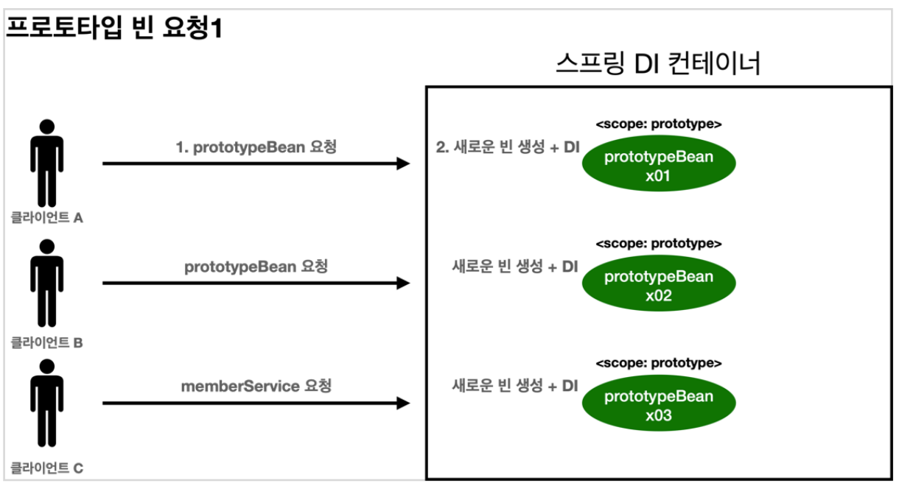
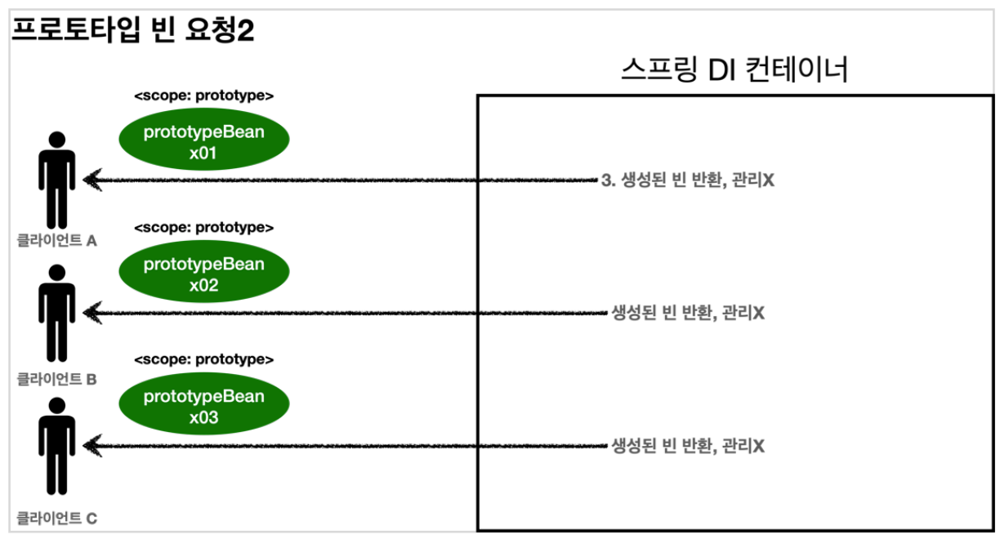
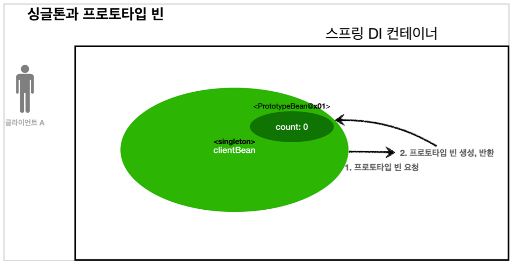
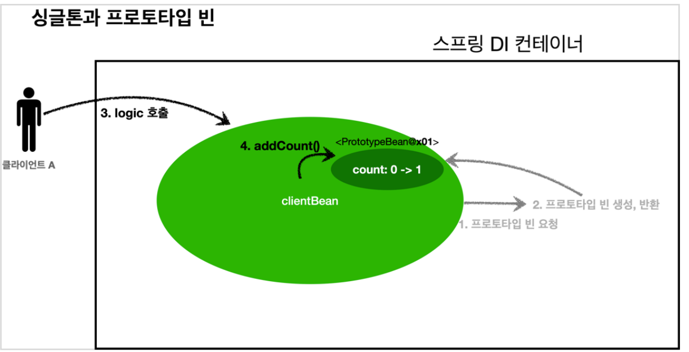
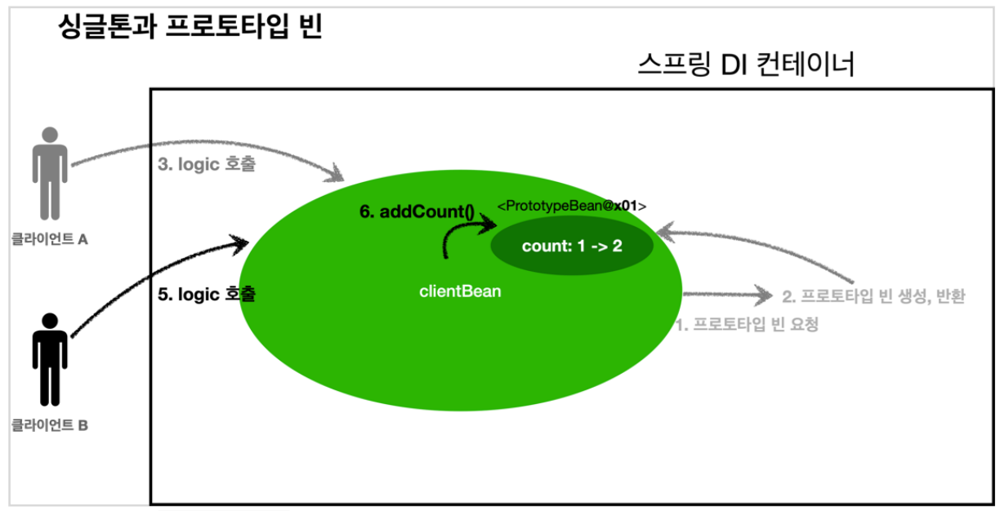
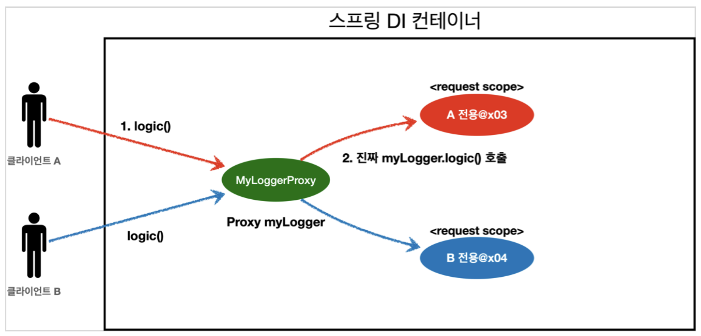

## 빈 스코프란?
빈이 존재할 수 있는 범위  
* 싱글톤: 스프링 컨터이너의 시작과 종료까지 유지되는 **가장 넓은 범위**의 스코프 - 기본 스코프
* 프로토타입: 프로토 타입의 생성과 의존관계 주입까지 스프링 컨테이너가 관여하고 그 이후로는 관리하지 않는 **매우 짧은 범위**의 스코프
* 웹 관련 스코프
  * request: HTTP 요청이 들어오고 나갈때 까지 유지
  * session: 웹 세션이 생성되고 종료될 때 까지 유지
  * application: 웹의 서블릿 컨텍스트와 같은 범위로 유지

컴포넌트 스캔 자동 등록 방법
~~~java
@Scope("prototype")
@Compoent
public class xxx {
    ...
}
~~~

수동 등록
~~~java
@Scope("prototype")
@Bean
PrototypeBean xxx() {
    return new xxx();
}
~~~

## 프로토타입 스코프
프로토타입 스코프를 스프링 컨테이너에 조회하면 스프링 컨테이너는 항상 `새로운 인스턴스`를 생성해서 반환  
<div></div>
<div></div>

1. 프로토타입 스코프의 빈을 스프링 컨테이너에 요청
2. 스프링 컨테이너는 이 시점에 프로토타입 빈을 생성하고, 필요한 의존관계 주입
3. 스프링 컨테이너는 생성한 프로토타입 빈을 클라이이언트에 반환
4. 스프링 컨테이너에 같은 요청이 오면 항상 새로운 프로토타입 빈을 생성해서 반환

스프링 컨테이너는 생성된 프로토타입 빈을 관리하지 않고 모든 책임은 **클라이언트**에 있다. 그래서 @PreDestory 같은 종료 메서드가 호출되지 않는다.

### 프로토 타입 스코프 빈 테스트
~~~java
public class PrototypeTest {

    @Test
    void prototypeBeanFind(){
        AnnotationConfigApplicationContext ac = new AnnotationConfigApplicationContext(PrototypeBean.class);
        System.out.println("find prototypeBean1");
        PrototypeBean prototypeBean1 = ac.getBean(PrototypeBean.class);
        System.out.println("find prototypeBean2");
        PrototypeBean prototypeBean2 = ac.getBean(PrototypeBean.class);
        System.out.println("prototypeBean1 = " + prototypeBean1);
        System.out.println("prototypeBean2 = " + prototypeBean2);
        assertThat(prototypeBean1).isNotSameAs(prototypeBean2);

        ac.close();
    }

    @Scope("prototype")
    static class PrototypeBean{
        @PostConstruct
        public void init(){
            System.out.println("PrototypeBean.init");
        }

        @PreDestroy
        public void destroy(){
            System.out.println("PrototypeBean.destroy");
        }
    }
}

~~~
결과
~~~
find prototypeBean1
PrototypeBean.init
find prototypeBean2
PrototypeBean.init
prototypeBean1 = hello.core.scope.PrototypeTest$PrototypeBean@4c1f22f3
prototypeBean2 = hello.core.scope.PrototypeTest$PrototypeBean@598bd2ba
21:15:06.534 [main] DEBUG org.springframework.context.annotation.AnnotationConfigApplicationContext - Closing org.springframework.context.annotation.AnnotationConfigApplicationContext@2d710f1a, started on Sat Apr 16 21:15:06 KST 2022
~~~

스프링 컨테이너가 프로토타입의 생성과 의존관계 주입 그리고 초기화까지 관여하고 더 이상 관리하지 않기 때문에 종료 메서드가 실행되지 않는다.

## 프로토 타입 스코프 - 싱글톤 빈과 함께 사용시 문제점
<div></div>
clientBean은 싱글톤이므로, 스프링 컨테이너 생성 시점에 함께 생성되고, 의존관계 주입 발생

1. clientBean은 의존관계 자동 주입으로 주입 시점에 스프링 컨테이너에 프로토타입 빈을 요청
2. 스프링 컨테이너는 프토토타입 빈을 생성해서 clientBean에 반환 count = 0
3. clientBean은 프로토타입 빈을 내부 필드에 보관

<div></div>
클라이언트A는 clientBean을 스프링 컨테이너에 요청해서 받는다. 싱글톤이므로 항상 같은 clientBean 반환

4. 클라이언트 A는 client.logic() 호출
5. clientBean은 prototypeBean의 addCount()를 호출 count = 1

<div></div>

클라이언트B는 clientBean을 스프링 컨테이너에 요청해서 받는다. 싱글톤이므로 항상 같은 clientBean 반환  
`clientBean 내부에 있는 프로토타입 빈은 이미 주입이 끝난 빈이므로 사용할 때마다 새로 생성되는게 아니다.`

6. 클라이언트 B는 clientBean.logic() 호출
7. clientBean은 prototypeBean의 addCount()를 호출 count = 2

### 테스트 코드
~~~java
public class SingleTonWithPrototypeTest1 {
    @Test
    void singletonClientTUsePrototype(){
        AnnotationConfigApplicationContext ac =
                new AnnotationConfigApplicationContext(PrototypeBean.class, ClientBean.class);
        ClientBean clientBean1 = ac.getBean(ClientBean.class);
        int count1 = clientBean1.logic();

        assertThat(count1).isEqualTo(1);

        ClientBean clientBean2 = ac.getBean(ClientBean.class);
        int count2 = clientBean2.logic();
        assertThat(count2).isEqualTo(2);
    }

    @Scope("singleton")
    static class ClientBean{

        @Autowired
        private PrototypeBean prototypeBean;

        public int logic(){
            prototypeBean.addCount();
            return prototypeBean.getCount();
        }
    }

    @Scope("prototype")
    static class  PrototypeBean {
        private int count = 0;

        public void addCount(){
            count++;
        }

        public int getCount(){
            return count;
        }

        @PostConstruct
        public void init(){
            System.out.println("PrototypeBean.init " + this);
        }

        @PreDestroy
        public void destroy(){
            System.out.println("PrototypeBean.destroy");
        }
    }
}
~~~
프로토타입 빈을 쓰는 이유는 사용할 때마다 새로 생성해서 사용하는 걸 원하기 때문에 문제점이 발생한다.  
싱글톤 빈은 생성 시점에만 의존관계 주입을 받기 때문에 프로토 타입 빈이 새로 생성되지만 호출할때마다 생성되는게 아니라 싱글톤처럼 하나의 프로토타입 빈이 유지된다.  

> 여러 빈에서 같은 프로토타입 빈을 주입 받으면, **주입 받는 시점에 각각 새로운 프로토타입 빈이 생성**된다. 예를 들어서 clientA, clientB가 각각 의존관계 주입을 받으면 각각 다른 인스턴스의 프로토타입 빈을 주입 받는다.  
> clientA -> prototypeBean@x01  
> clientB -> prototypeBean@x02  
>물론 사용할 때마다 새로 생성되는 것은 아니다.

## 프로토 타입 스코프 - 싱글톤 빈과 함께 사용시 Provider로 문제 해결
가장 간단한 해결 방법은 싱글톤 빈이 프로토타입을 사용할 때 마다 스프링 컨테이너에 요청하는 것이다.
~~~java
@Autowired
private ApplicationContext ac;
public int logic() {
    PrototypeBean prototypeBean = ac.getBean(PrototypeBean.class);
    prototypeBean.addCount();
    int count = prototypeBean.getCount();
    return count;
~~~
* ac.getBean()을 통해서 항상 새로운 프로토타입 빈이 생성된다.
* `Dependency Lookup`: 의존 관계를 외부해서 주입(DI)하는게 아니라 직접 필요한 의존관계를 찾는 방법
* 스프링의 애플리케이션 컨텍스트 전체를 주입받게 되면, 스프링 컨테이너에 **종속적**인 코드가 되고 단위 테스트 어려움

**ObjectFactory**, **ObjectProvider** 사용으로 해결  
* ObjectFactory: 기능이 단순, 별도의 라이브러리 필요 없음, 스프링에 의존
* ObjectProvider: ObjectFactory 상속하여 옵션, 스트림 처리등 편의 기능이 많고, 별도의 라이브러리 필요 없음, 스프링에 의존
코드 수정
~~~java
@Scope("singleton")
    static class ClientBean{
        @Autowired
        private Provider<PrototypeBean> prototypeBeanProvider;
        public int logic(){
            PrototypeBean prototypeBean = prototypeBeanProvider.getObject(); // 새로운 프로토타입 빈 생성
            prototypeBean.addCount();
            return prototypeBean.getCount();
        }
    }
~~~

* getObject() 호출시 내부에서 스프링 컨텡이너를 통해 해당 빈을 찾아서 반환 -> `Dependency Lookup`
* 스프링이 제공하는 기능을 사용하지만, 기능이 단순해서 단위 테스트나 mock 코드를 만들기 수월

**JSR-330 Provider**
`JSR-330`: javax.inject.Provider이라는 자바 표준 사용  
build.gradle에 라이브러리 추가 
```
implementation 'javax.inject:javax.inject:1'
```
코드 변경
~~~java
@Autowired
private Provider<PrototypeBean> provider;
public int logic() {
    PrototypeBean prototypeBean = provider.get();
    prototypeBean.addCount();
    int count = prototypeBean.getCount();
    return count;
}
~~~

* provider.get() 호출시 항상 새로운 프로토타입 빈이 생성  -> `Dependency Lookup`
* 자바 표준이고, 기능이 단순하므로 단위테스트를 만들거나 mock 코드를 만들기 수월
* 별도의 라이브러리 필요
* 자바 표준이므로 스프링이 아닌 다른 컨테이너에서 사용 가능


> **@Lookup** 어노테이션을 사용하는 방법도 있다.  
> 참고: 스프링이 아닌 다른 컨테이너에서 사용할 수 있어야하면 JSR-330 Provider, 그 외에는 스프링이 제공하는 기능 사용

## 웹 스코프
웹 환경에서만 동작하며 스프링이 해당 스코프의 종료 시점까지 관리한다.

* requset: HTTP 요청 **하나**가 들어오고 나갈 때 까지 유지되는 스코프
* session: HTTP session과 동일한 생명주기를 가지는 스코프
* application: 서블릿 컨텍스트와 동일한 생명주기를 가지는 스코프
* websocket: 우베 소켓과 동일한 생명주기를 가지는 스코프

buidl.gradle에 라이브러리 추가
~~~
implementation 'org.springframework.boot:spring-boot-starter-web'
~~~

hello.core.coreApplication의 main 메소드를 실행시켰을때 아래와 같이 나오면 성공
~~~
Tomcat started on port(s): 8080 (http) with context path ''
Started CoreApplication in 0.914 seconds (JVM running for 1.528)
~~~

> spring-boot-starter-web 라이브러리를 추가하면 스프링 부트는 내장 톰켓 서버를 활용해서 웹서버와 스프링을 함께 실행  
> 웹 라이브러리가 추가되면 웹과 관련된 추가 설정과 환경들이 필요하므로 `AnnotationConfigServletWebServerApplicationContext`을 기반으로 구동

### 웹 스코프 예제
동시에 여러 HTTP 요청이 오면 구분하기 어렵다. 이럴때 사용하기 좋은것이 **request 스코프**  
* UUID: HTTP 요청 구분
* requestURL: 요청한 URL 확인

로그를 출력하기 위해 MyLogger 클래스 생성
~~~java
@Component
@Scope(value = "request", proxyMode = ScopedProxyMode.TARGET_CLASS)
public class MyLogger {

    private String uuid;
    private String requestURL;

    public void setRequestURL(String requestURL) {
        this.requestURL = requestURL;
    }

    public void log(String message) {
        System.out.println("[" + uuid + "]" + "[" + requestURL + "] " + message);
    }

    @PostConstruct
    public void init(){
        uuid = UUID.randomUUID().toString(); // 거의 겹치지않는 범용 고유 식별자(uuid) 생성
        System.out.println( "[" + uuid + "] request scope bean create:" + this);
    }

    @PreDestroy
    public void close(){
        System.out.println("[" + uuid + "] request scope bean close:" + this);
    }
}
~~~

* 빈이 생성되는 시점에 자동으로 init() 초기화 메소드가 실행될때 uuid를 생성하면 HTTP 요청마다 구분 가능
* requestURL은 빈이 생성되는 시점에 알 수 없으므로 외부에서 setter로 받음

MyLogger가 잘 작동되는지 확인하기 위한 LogDemoController 생성
~~~java
@Controller
@RequiredArgsConstructor
public class LogDemoController {

    private final LogDemoService logDemoService;
    private final MyLogger myLogger;

    @RequestMapping("log-demo") //https://localhost:8080/log-demo
    @ResponseBody
    public String logDemo(HttpServletRequest request) {
        String requestURL = request.getRequestURL().toString();

        System.out.println("myLogger = " + myLogger.getClass());
        myLogger.setRequestURL(requestURL);

        myLogger.log("controller test");
        logDemoService.logic("testId");
        return "OK";
    }
}
~~~

* HttpServletRequest를 통해서 요청 URL 받음
* myLogger에 URL 저장
* 컨트롤러에서 controller test 로그 남긴다.

> requestURL을 MyLogger에 저장하는 부분을 컨트롤러 보다 공통 처리가 가능한 `스프링 인터셉터`나 `서블릿 필터`같은 곳을 활용하는 것이 좋다.

LogDemoService 생성
~~~java
@Service
@RequiredArgsConstructor
public class LogDemoService {
    private final MyLogger myLogger;
    public void logic(String id) {
        myLogger.log("service id = " + id);
    }

}
~~~

request scope를 사용하지 않고 파라미터로 넘긴다면 웹과 관련도 없는 서비스 계층까지 넘어간다.  
`서비스 계층은 웹 기술에 종속되지 않고, 가급적 순수하게 유지하는 것이 좋다.`  
CoreApplication을 실행하고 http://localhost:8080/log-demo로 접속하면 에러가 뜬다. 그 이유는 스프링 컨테이너에 의존관계 주입시 MyLogger는 HTTP request 요청이 없는데 request 빈을 조회하기  때문이다.

### Provider로 해결
LogDemoController provider 적용
~~~java
@Controller
@RequiredArgsConstructor
public class LogDemoController {

    private final LogDemoService logDemoService;
    private final ObjecetProvider<MyLogger> myLoggerProvider;

    @RequestMapping("log-demo") //http://localhost:8080/log-demo
    @ResponseBody
    public String logDemo(HttpServletRequest request) {
        String requestURL = request.getRequestURL().toString();
        MyLogger myLogger = MyLoggerProvider.getObject();
        myLogger.setRequestURL(requestURL);
        myLogger.log("controller test");
        logDemoService.logic("testId");
        return "OK";
    }
~~~

LogDemoService 수정
~~~java
@Service
@RequiredArgsConstructor
public class LogDemoService {

    private final ObjectProvider<MyLogger> myLoggerProvider;

    public void logic(String id) {
        MyLogger myLogger = myLoggerProvider.getObject();
        myLogger.log("service id = " + id);
    }

}
~~~

main() 메소드를 실행하고 https://localhost:8080/log-demo에 접속하면 콘솔창에 로그를 확인할 수 있다.
~~~
[eaa5f184-b993-4b19-861d-0dad68dd2b60] request scope bean create:hello.core.common.MyLogger@52496b84
[eaa5f184-b993-4b19-861d-0dad68dd2b60][http://localhost:8080/log-demo] controller test
[eaa5f184-b993-4b19-861d-0dad68dd2b60][http://localhost:8080/log-demo] service id = testId
[eaa5f184-b993-4b19-861d-0dad68dd2b60] request scope bean close:hello.core.common.MyLogger@52496b84
~~~

* ObjectProvider 덕분에 ObjectProvider.getObject()를 호출하는 시점까지 request scope 빈의 **생성 지연**
* ObjectProvider.getObject()를 호출하는 시점에는 HTTP 요청이 진행중이므로 request scope 빈 생성

### 스코프와 프록시
더 간단하게 프록시 방식으로 해결
~~~java
@Component
@Scope(value = "request", proxyMode = ScopedProxyMode.TARGET_CLASS)
public class MyLogge{
    ...
}
~~~

`proxyMode = ScopedProxyMode.TARGET_CLASS` 추가  
프록시 적용 대상이 클래스면 **TARGET_CALSS**, 인터페이스면 **INTERFACE**  
LogDemoController와 LogDemoService를 Provider 적용전으로 코드를 되돌리고 실행하면 정상 작동한다.

## 웹 스코프와 프록시 동작 방식
myLogger를 확인해보자.
~~~java
System.our.println("myLooger = " + myLogger.getClass());
//MyLogger = class hello.core.common.MyLogger$$EnhancerBySpringCGLIB$$7929509b
~~~
* 스프링 컨테이너가 **CGLIB**(바이트코드 조작 라이브러리)를 사용하여 MyLogger를 상속받은 가짜 프록시 객체를 생성  
* 의존관계 주입도 가짜 프록시 객체가 주입된다.
<div></div>

클라이언트가 myLogger.logic()을 호출(가짜 프록시 객체)  -> 가짜 프록시 객체는 request scope의 진짜 myLogger.logic() 호출  
클라이언트 입장에서는 원본인지 아닌지 모르고 사용 가능하다 -> 다형성  

### 동작 정리
* CGLIB라는 라이브러리로 내 클래스를 상속 받은 **가짜 프록시 객체**를 만들어서 주입한다.
* 이 가짜 프록시 객체는 실제 요청이 오면 그때 내부에서 실제 빈을 요청하는 위임 로직이 들어있다. 
* 가짜 프록시 객체는 실제 request scope와는 관계가 없다. 그냥 가짜이고, 내부에 단순한 위임 로직만 있고, `싱글톤`처럼 동작한다.

### 특징
* 프록시 객체 덕분에 클라이언트는 마치 싱글톤 빈을 사용하듯이 편리하게 request scope를 사용할 수 있다.
* 사실 Provider를 사용하든, 프록시를 사용하든 핵심 아이디어는 `진짜 객체 조회를 꼭 필요한 시점까지 지연처리`
* 단지 애노테이션 설정 변경만으로 원본 객체를 프록시 객체로 대체할 수 있다: 이것이 바로 **다형성**과 **DI 컨테이너**가 가진 큰 강점이다.
* 꼭 웹 스코프가 아니어도 프록시는 사용할 수 있다.

### 주의점
* 마치 싱글톤을 사용하는 것 같지만 다르게 동작하기 때문에 결국 주의해서 사용해야 한다.
* 이런 특별한 scope는 꼭 필요한 곳에만 최소화해서 사용하자, 무분별하게 사용하면 유지보수하기 어려워진다.

