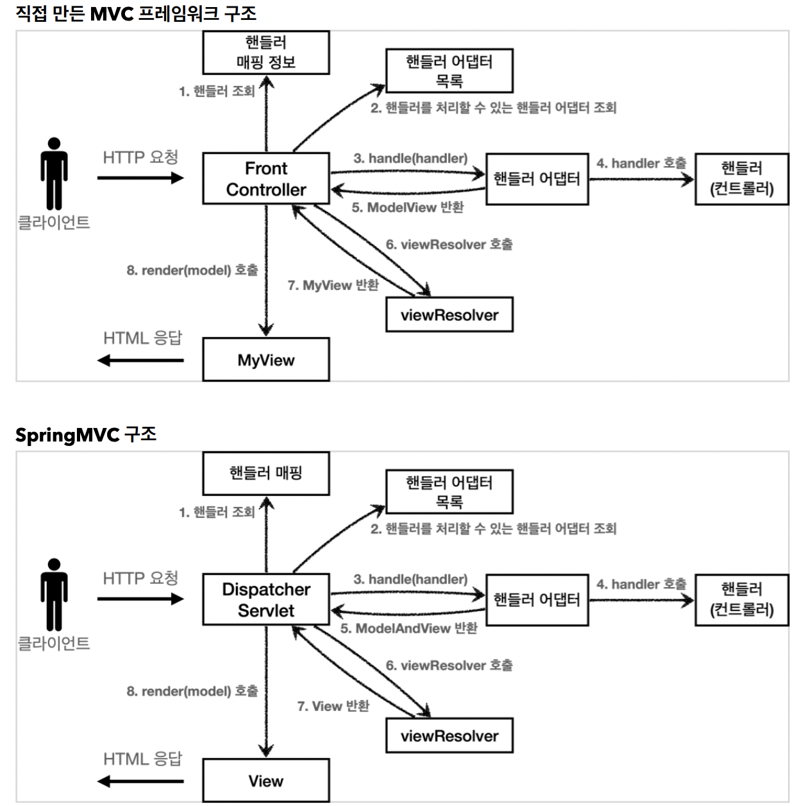

## 직접 만든 MVC VS Spring MVC 

구조는 비슷하고 각 대응되는 이름만 변경 되었다. 스프링 MVC에서 핵심은 `DispatcherServlet`

## DispatcherServlet
DispatcherServlet은 부모 클래스인 **HttpServlet**을 상속 받았고, 서블릿으로 동작한다.  
스프링 부트는 DispatcherServlet을 서블릿으로 자동 등록하고 **모든 경로(urlPattern = "/")**에 대해서 매핑한다. 

### 요청 흐름
* 서블릿이 호출되면 HttpServlet이 제공하는 **serivce()**가 호출된다.
* 스프링 MVC는 DispatcherServlet의 부모인 FrameworkServlet에서 service()를 오버라이드 해두었다.
* FrameworkServlet.service()를 시작으로 여러 메서드가 호출되면서 DispacherServlet.doDispatch()가 호출된다.

### DispacherServlet의 핵심인 doDispatch() 코드 분석
간결한 설명을 위해 예외 처리, 인터셉터 기능은 제외했다.
~~~java
protected void doDispatch(HttpServletRequest request, HttpServletResponse response) throws Exception {
    HttpServletRequest processedRequest = request;
    HandlerExecutionChain mappedHandler = null;
    ModelAndView mv = null;

    // 1. 핸들러 조회
    mappedHandler = getHandler(processedRequest);
    if (mappedHandler == null) {
        noHandlerFound(processedRequest, response);
        return;
    }

    // 2. 핸들러 어댑터 조회 - 핸들러를 처리할 수 있는 어댑터
    HandlerAdapter ha = getHandlerAdapter(mappedHandler.getHandler());
    
    // 3. 핸들러 어댑터 실행 -> 4. 핸들러 어댑터를 통해 핸들러 실행 -> 5. ModelAndView 반환
    mv = ha.handle(processedRequest, response, mappedHandler.getHandler());
    processDispatchResult(processedRequest, response, mappedHandler, mv, dispatchException);
}

private void processDispatchResult(HttpServletRequest request,
    HttpServletResponse response, HandlerExecutionChain mappedHandler, ModelAndView
    mv, Exception exception) throws Exception {
        
        // 뷰 렌더링 호출
        render(mv, request, response);
    }
protected void render(ModelAndView mv, HttpServletRequest request, HttpServletResponse response) throws Exception {
    View view;
    String viewName = mv.getViewName();
    
    // 6. 뷰 리졸버를 통해서 뷰 찾기, 7. View 반환
    view = resolveViewName(viewName, mv.getModelInternal(), locale, request);
    
    // 8. 뷰 렌더링
    view.render(mv.getModelInternal(), request, response);
}
~~~

### 동작 순서
1. 핸들러 조회: 핸들러 매핑을 통해 요청 URL에 매핑된 핸들러(컨트롤러)를 조회한다.
2. 핸들러 어댑터 조회: 핸들러를 실행할 수 있는 핸들러 어댑터를 조회한다.
3. 핸들러 어댑터 실행: 핸들러 어댑터를 실행한다.
4. 핸들러 실행: 핸들러 어댑터가 실제 핸들러를 실행한다.
5. ModelAndView 반환: 핸들러 어댑터는 핸들러가 반환하는 정보를 ModelAndView로 변환해서 반환한다.
6. viewResolver 호출: 뷰 리졸버를 찾고 실행한다. 
   * JSP의 경우: `InternalResourceViewResolver`가 자동 등록되고, 사용된다.
7. View 반환: 뷰 리졸버는 뷰의 논리 이름을 물리 이름으로 바꾸고, 렌더링 역할을 담당하는 뷰 객체를 반환한다.
   * JSP의 경우 `InternalResourceView(JstlView)`를 반환하는데, 내부에 `forward()`로직이 있다.
8. 뷰 렌더링: 뷰를 통해서 뷰를 렌더링 한다.

### 인터페이스
스프링 MVC의 가장 큰 장점은 DispatcherServlet의 코드 변경 없이 확장 가능하다. 그 이유는 지금까지 설명했던 것들이 **인터페이스**로 제공하기 때문에 구현해 DispatcherServlet에 등록하면 원하는 컨트롤러를 만들 수 있다.  
주오 인터페이스 목록
* 핸들러 매핑: `org.springframework.web.servlet.HandlerMapping`
* 핸들러 어댑터: `org.springframework.web.servlet.HandlerAdapter`
* 뷰 리졸버: `org.springframework.web.servlet.ViewResolver`
* 뷰: `org.springframework.web.servlet.View`

## 핸들러 맵핑과 핸들러 어댑터
지금은 사용하지 않지만 과거에 사용했던 스프링이 제공하는 컨트롤러로 핸들러 매핑과 어댑터 알아보자

### Controller 인터페이스
~~~java
public interface Controller {
    ModelAndView handleRequest(HttpServletRequest request, HttpServletResponse response) throws Exception;
}
~~~

> Controller 인터페이스와 @Controller 어노테이션은 전혀 다르다.

### OldController - 구현체
~~~java
@Component("/springmvc/old-controller")
public class OldController implements Controller {
    @Override
    public ModelAndView handleRequest(HttpServletRequest request, HttpServletResponse response) throws Exception {
        System.out.println("OldController.handleRequest");
        return null;
    }
}
~~~
* /springmvc/old-controller라는 이름의 스프링 빈으로 등록하고 **빈 이름으로 url 맵핑**  
* http://localhost:8080/springmvc/old-controller로 접속하여 콘솔에 OldController.handleRequest이 출력되면 성공

이 컨트롤러가 호출 되려면 **핸들러 맵핑**과 **핸들러 어댑터**가 필요하다. 핸들러 맵핑에서 컨트롤러를 찾고 핸들러 어댑터에서 핸들러 맵핑으로 찾은 컨트롤러를 실행할 수 있는 어댑터를 찾아 실행한다.  
스프링은 이미 필요한 핸들러 매핑과 핸들러 어댑터를 대부분 구현해두었다.

### 스프링 부트가 자동으로 등록하는 핸들러 매핑과 핸들러 어댑터
실제로는 더 많지만, 중요한 부분 위주로 설명하기 위해 일부 생략했다.

HandlerMapping
~~~
0 = RequestMappingHandlerMapping : 애노테이션 기반의 컨트롤러인 @RequestMapping에서 사용
1 = BeanNameUrlHandlerMapping : 스프링 빈의 이름으로 핸들러를 찾는다.
~~~

HandlerAdapter
~~~
0 = RequestMappingHandlerAdapter : 애노테이션 기반의 컨트롤러인 @RequestMapping에서 사용
1 = HttpRequestHandlerAdapter : HttpRequestHandler 처리
2 = SimpleControllerHandlerAdapter : Controller 인터페이스(애노테이션X, 과거에 사용) 처리
~~~

순서대로 찾아서 있으면 반환한다.
위에 만들었던 컨트롤러에서는 스프링 빈 이름으로 등록했기 때문에 `BeanNameUrlHandlerMapping`에서 OldController를 반환하고, 핸들러 어댑터에서 우리는 Contorller 인터페이스를 이용했기 때문에 `SimpleControllerHandlerAdapter`를 실행하면서 핸들러 정보도 넘겨준다. 핸들러인 OldController를 내부에서 실행하고 결과를 반환한다.  

### HttpRequestHandler 인터페이스
핸들러 맵핑과, 어댑터를 잘 이해하기 위해 다른 형태의 핸들러를 만들어서 확인해보자
~~~java
public interface HttpRequestHandler {
    void handleRequest(HttpServletRequest request, HttpServletResponse response) throws ServletException, IOException;
}
~~~

### MyHttpRequestHandler - 구현체
~~~java
@Component("/springmvc/request-handler")
public class MyHttpRequestHandler implements HttpRequestHandler {
    @Override
    public void handleRequest(HttpServletRequest request, HttpServletResponse response) throws ServletException, IOException {
        System.out.println("MyHttpRequestHandler.handleRequest");
    }
~~~

* http://localhost:8080/springmvc/request-handler로 접속하여 콘솔에 MyHttpRequestHandler.handleRequest이 출력되면 성공

찾는 과정은 OldController와 같다. SimpleControllerHandlerAdapter대신 `HttpRequestHandlerAdapter`를 실행한다.

> 가장 우선 순위가 높은 핸들러 매핑과 어댑터는 **RequestMappingHandlerMapping**, **RequestMappingHandlerAdapter**인데 `@ReqeustMapping`의 앞글자를 따서 만들었다.  
> 스프링에서 주로 사용하는 어노테이션 기반을 지원하는 매핑과 어댑터로 실무에서 99.9% 이 방식의 컨트롤러를 사용한다.

## 뷰 리졸버
### OldContorller - view를 조회할 수 있도록 코드 변경
~~~java
@Component("/springmvc/old-controller") //스프링 빈의 이름
public class OldController implements Controller {
    @Override
    public ModelAndView handleRequest(HttpServletRequest request, HttpServletResponse response) throws Exception {
        System.out.println("OldController.handleRequest");
        return new ModelAndView("new-form");
        // 권장하지는 않지만 return new ModelAndView("/WEB-INF/views/new-form.jsp");으로 해도 실행됨
    }
}
~~~

* http://localhost:8080/springmvc/old-controller로 접속하여 확인
* 웹 브라우저에 Whitelabel Error Page 가 나오고, 콘솔에 OldController.handleRequest이 출력될 것이다.

application.properties에 코드 추가
~~~
spring.mvc.view.prefix=/WEB-INF/views/
spring.mvc.view.suffix=.jsp
~~~

뷰 리졸버 - InternalResourceViewResolver  
스프링 부트는 `InternalResourceViewResolver` 라는 뷰 리졸버를 자동으로 등록하는데 application.properties에 등록한 **spring.mvc.view.prefix** , **spring.mvc.view.suffix** 설정 정보를 사용해서 등록한다.

* http://localhost:8080/springmvc/old-controller에 접속하여 확인
* 등록 폼이 정상 출력되는 것을 확인할 수 있다. 물론 저장 기능을 개발하지 않았으므로 폼만 출력되고, 더 진행하면 오류가 발생한다.

### 스프링 부트가 자동으로 등록하는 뷰 리졸버
~~~
1 = BeanNameViewResolver : 빈 이름으로 뷰를 찾아서 반환한다. (예: 엑셀 파일 생성 기능에 사용)
2 = InternalResourceViewResolver : JSP를 처리할 수 있는 뷰를 반환한다
~~~

동작 방식
1. 핸들러 어댑터 호출
   * 핸들러 어댑터를 통해 new-form이라는 논리 뷰 이름을 획득한다.
2. ViewResolver 호출
   * new-form이라는 뷰 이름으로 viewResolver를 순서대로 호출한다.
   * BeanNameViewResolver 는 new-form 이라는 이름의 스프링 빈으로 등록된 뷰를 찾아야 하는데 없다.
   * `InternalResourceViewResolver`가 호출된다.
3. InternalResourceViewResolver
   * 이 뷰 리졸버는 **InternalResourceView**를 반환한다.
4. 뷰 - InternalResourceView
   * InternalResourceView는 JSP처럼 포워드 forward()를 호출해서 처리할 수 있는 경우에 사용한다.
5. view.render()
   * view.render() 가 호출되고 InternalResourceView는 forward() 를 사용해서 JSP를 실행한다.

> **참고**  
> InternalResourceViewResolver 는 만약 JSTL 라이브러리가 있으면 InternalResourceView 를 상속받은 JstlView 를 반환한다. JstlView 는 JSTL 태그 사용시 약간의 부가 기능이 추가된다.  

> **참고**  
> 다른 뷰는 실제 뷰를 렌더링하지만, JSP의 경우 forward() 통해서 해당 JSP로 이동(실행)해야 렌더링이 된다. JSP를 제외한 나머지 뷰 템플릿들은 forward() 과정 없이 바로 렌더링 된다.  

> **참고**  
> Thymeleaf 뷰 템플릿을 사용하면 ThymeleafViewResolver 를 등록해야 한다. 최근에는 라이브러리만 추가하면 스프링 부트가 이런 작업도 모두 자동화해준다.  

## 스프링 MVC 시작하기
스프링이 제공하는 컨트롤러는 **어노테이션 기반**으로 동작하여 매우 유연하고 실용적이다.

### @RequestMapping
가장 우선순위가 높은 핸들러 매핑과 핸들러 어댑터는 `RequestMappingHandlerMapping` ,`RequestMappingHandlerAdapter`이다.  
`@RequestMapping`의 앞글자를 따서 만든 이름인데, 이것이 바로 지금 스프링에서 주로 사용하는 어노테이션 기반의 컨트롤러를 지원하는 핸들러 매핑과 어댑터이다.

### SpringMemberFormControllerV1 - 회원 등록 폼
~~~java
@Controller
public class SpringMemberFormControllerV1 {

    @RequestMapping("/springmvc/v1/members/new-form")
    public ModelAndView process(){
        return new ModelAndView("new-form"); // 모델과 뷰 정보를 담아서 반환
    }
}
~~~

* @Controller: 스프링이 자동으로 스프링 빈에 등록, 스프링 MVC에서 어노테이션 기반 컨트롤러로 인식한다.
* @RequestMapping: 해당 url이 요청되면 메소드 실행. 메소드 이름은 상관없다.

`RequestMappingHandlerMapping`은 스프링 빈 중에서 @RequestMapping 또는 @Controller가 **클래스 레벨**에 붙어 있는 경우에 매핑 정보로 인식한다.
~~~java
@Component //컴포넌트 스캔을 통해 스프링 빈으로 등록
@RequestMapping
public class SpringMemberFormControllerV1 {
    @RequestMapping("/springmvc/v1/members/new-form")
    public ModelAndView process() {
        return new ModelAndView("new-form");
    }
}
~~~
동일하게 동작한다.

* http://localhost:8080/springmvc/v1/members/new-form로 접속하여 확인

### SpringMemberSaveControllerV1
~~~java
@Controller
public class SpringMemberSaveControllerV1 {

    private final MemberRepository memberRepository = MemberRepository.getInstance();

    @RequestMapping("/springmvc/v1/members/save")
    public ModelAndView process(HttpServletRequest request, HttpServletResponse response) {
        String username = request.getParameter("username");
        int age = Integer.parseInt(request.getParameter("age"));

        Member member = new Member(username, age);
        memberRepository.save(member);

        ModelAndView mv = new ModelAndView("save-result");
        mv.addObject("member",member);
        return mv;
    }
}
~~~

* `mv.addObject("member", member)`: 스프링이 제공하는 **ModelAndView**를 통해 Model 데이터를 추가할 때는 addObject()를 사용하면 된다. 이 데이터는 이후 뷰를 **렌더링**할 때 사용된다.

### SpringMemberListControllerV1
~~~java
@Controller
public class SpringMemberListControllerV1 {

    private MemberRepository memberRepository = MemberRepository.getInstance();

    @RequestMapping("/springmvc/v1/members")
    public ModelAndView process() {

        List<Member> members = memberRepository.findAll();

        ModelAndView mv = new ModelAndView("members");
        mv.addObject("members",members);
        return mv;
    }
}
~~~

* 등록: http://localhost:8080/springmvc/v1/members/new-form
* 목록: http://localhost:8080/springmvc/v1/members

## 스프링 MVC - 컨트롤러 통합
@RequestMapping을 잘 보면 클래스 단위가 아니라 **메서드 단위**에 적용된 것을 확인할 수 있다. 따라서 컨트롤러 클래스를 유연하게 하나로 통합할 수 있다.  
또한 /springmvc/v2/members가 중복되기 때문에 클래스 레벨에 @RequestMapping("/springmvc/v2/members")을 두면 중복을 제거할 수 있다.

### SpringMemberControllerV2
~~~java
@Controller
@RequestMapping("springmvc/v2/members")
public class SpringMemberControllerV2 {

    private final MemberRepository memberRepository = MemberRepository.getInstance();

    @RequestMapping("/new-form")
    public ModelAndView newForm(){
        return new ModelAndView("new-form");
    }

    @RequestMapping("/save")
    public ModelAndView save() {

        List<Member> members = memberRepository.findAll();

        ModelAndView mv = new ModelAndView("members");
        mv.addObject("members",members);
        return mv;
    }

    @RequestMapping()
    public ModelAndView members(HttpServletRequest request, HttpServletResponse response) {
        String username = request.getParameter("username");
        int age = Integer.parseInt(request.getParameter("age"));

        Member member = new Member(username, age);
        memberRepository.save(member);

        ModelAndView mv = new ModelAndView("save-result");
        mv.addObject("member",member);
        return mv;
    }
}
~~~

* 등록: http://localhost:8080/springmvc/v2/members/new-form
* 목록: http://localhost:8080/springmvc/v2/members

## 스프링 MVC - 실용적인 방식
스프링 MV는 개발자 편리하게 개발할 수 있도록 많은 편의 기능을 제공한다.

### SpringMemberControllerV3
~~~java
@Controller
@RequestMapping("springmvc/v3/members")
public class SpringMemberControllerV3 {
    private final MemberRepository memberRepository = MemberRepository.getInstance();

    @GetMapping("/new-form")
    public String newForm(){
        return "new-form";
    }

    @PostMapping("/save")
    public String save(
            @RequestParam("username") String username,
            @RequestParam("age") int age,
            Model model) {

        Member member = new Member(username, age);
        memberRepository.save(member);

        model.addAttribute("member", member);
        return "save-result";
    }

    @GetMapping()
    public ModelAndView members(HttpServletRequest request, HttpServletResponse response) {
        String username = request.getParameter("username");
        int age = Integer.parseInt(request.getParameter("age"));

        Member member = new Member(username, age);
        memberRepository.save(member);

        ModelAndView mv = new ModelAndView("save-result");
        mv.addObject("member",member);
        return mv;
    }
}
~~~

* Model 파라미터: save() , members()를 보면 Model을 파라미터로 받는 것을 확인할 수 있다
* viewName 반환: 뷰 논리 이름 반환
* @RequestParam: 스프링은 HTTP 요청 파라미터를 @RequestParam 으로 받을 수 있다.
* @RequestMapping -> @GetMapping, @PostMapping:URL 매핑뿐만 아니라 HTTP Method도 함께 구분할 수 있다.

* 등록: http://localhost:8080/springmvc/v3/members/new-form
* 목록: http://localhost:8080/springmvc/v3/members