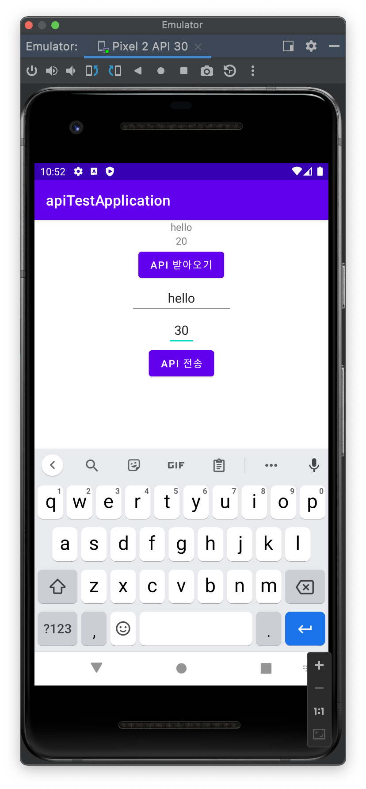
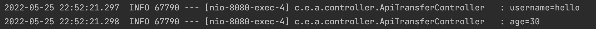

## GET으로 서버에서 안드로이드로 데이터 전송 받기
### Android Studio
AndroidMenifest에 코드  추가
~~~xml
<application>
    android:usesCleartextTraffic="true"
</application>
...
<uses-permission android:name="android.permission.INTERNET"/>
~~~

* `android:usesCleartextTraffic="true"`: HTTP 연결 허용
* `android.permission.INTERNET`: 인터넷 연결 허용

<details>
<summary>activity_main.xml 코드</summary>
<div markdown="1">
```xml
<?xml version="1.0" encoding="utf-8"?>
<LinearLayout xmlns:android="http://schemas.android.com/apk/res/android"
    xmlns:tools="http://schemas.android.com/tools"
    android:layout_width="match_parent"
    android:layout_height="match_parent"
    android:orientation="vertical"
    tools:context=".MainActivity">

    <TextView
        android:layout_width="wrap_content"
        android:layout_height="wrap_content"
        android:layout_gravity="center"
        android:text="이름"
        android:id="@+id/getName" />
    <TextView
        android:layout_width="wrap_content"
        android:layout_height="wrap_content"
        android:layout_gravity="center"
        android:text="나이"
        android:id="@+id/getAge"/>

    <Button
        android:id="@+id/getApiButton"
        android:layout_width="wrap_content"
        android:layout_height="wrap_content"
        android:layout_gravity="center"
        android:text="Api 받아오기" />
</LinearLayout>
```

</div>
</details>

전송 받은 데이터를 저장할 객체 클래스 **userDTO.class**
~~~java
public class UserDTO {

    private String username;
    private int age;

    public UserDTO(String username, int age) {
        this.username = username;
        this.age = age;
    }

    //Getter
    ...
    
    //Setter
    ...
}
~~~

HTTP 통신을 위한 Retrofit2 라이브러리 사용하기 위해 app수준 build.gradle에 의존성 추가
~~~
implementation 'com.squareup.retrofit2:retrofit:2.9.0'
implementation 'com.squareup.retrofit2:converter-gson:2.9.0'
~~~

Retrofit 클래스
~~~java
public class RetrofitClient {

    private static RetrofitClient instance = null;
    private static UserRetrofitInterface userRetrofitInterface;
    private static String baseUrl = "http://10.0.2.2:8080/";

    private RetrofitClient() {
        retrofit2.Retrofit retrofit = new retrofit2.Retrofit.Builder()
                .baseUrl(baseUrl)
                .addConverterFactory(GsonConverterFactory.create())
                .build();
        userRetrofitInterface = retrofit.create(UserRetrofitInterface.class);
    }

    public static RetrofitClient getInstance() {
        if (instance == null) {
            instance = new RetrofitClient();
        }
        return instance;
    }

    public static UserRetrofitInterface getUserRetrofitInterface() {
        return userRetrofitInterface;
    }
}
~~~

* baseUrl: 서버가 구동되고 있는 ip주소
  * 안드로이드는 localhost:8080 대신 10.0.2.2:8080을 사용해야한다.
* addConverterFactory(GsonConverterFactory.create()): 서버로부터 데이터를 받아와서 원하는 타입으로 데이터를 바꾸기 위해 사용 
* baseUrl 뒷부분을 쉽게 처리할 수 있도록 인터페이스 제공

RetrofitInterface
~~~java
public interface UserRetrofitInterface {

    @GET("user")
    Call<UserDTO> getUSer();
}
~~~

MainActiviy.class
~~~java
public class MainActivity extends AppCompatActivity {
    Button getApiBtn;
    UserRetrofitInterface userRetrofitInterface;
    Call<UserDTO> call;

    @Override
    protected void onCreate(Bundle savedInstanceState) {
        super.onCreate(savedInstanceState);
        setContentView(R.layout.activity_main);

        getApiBtn = (Button) findViewById(R.id.getApiButton);
        TextView usernameText = (TextView) findViewById(R.id.getName);
        TextView userAgeText  = (TextView) findViewById(R.id.getAge);

        RetrofitClient retrofitClient = RetrofitClient.getInstance();
        UserRetrofitInterface userRetrofitInterface = RetrofitClient.getUserRetrofitInterface();

        getApiBtn.setOnClickListener(new View.OnClickListener() {
            @Override
            public void onClick(View v) {
                call = userRetrofitInterface.getUSer();
                call.clone().enqueue(new Callback<UserDTO>() {
                    @Override
                    public void onResponse(Call<UserDTO> call, Response<UserDTO> response) {
                        if (response.isSuccessful()) {
                            usernameText.setText(response.body().getUsername());
                            userAgeText.setText(Integer.toString(response.body().getAge()));
                        }
                    }

                    @Override
                    public void onFailure(Call<UserDTO> call, Throwable t) {
                        Log.e("retrofit 연동", "실패");
                        t.printStackTrace();
                    }
                });
            }
        });
    }
}
~~~

### Spring boot 
### User
~~~java
@Getter
@Setter
public class User {

    private String username;
    private int age;

    public User() {
    }

    public User(String username, int age) {
        this.username = username;
        this.age = age;
    }
}
~~~

### ApiTransferController
~~~java
@Slf4j
@RestController
public class ApiTransferController {

    @GetMapping(value = "/user", produces = MediaType.APPLICATION_JSON_VALUE)
    @ResponseBody
    public User userData() {
        User user = new User("hello", 20);

        return user;
    }
}
~~~

localhost:8080/user 요청이 들어오면 User 객체를 HTTP 응답 메시지 Body에 담아 반환하면 안드로이드에서 수신한다.

## POST
### Android Studio
<details>
<summary>activity_main.xml 코드에 추가</summary>
<div markdown="1">

<EditText
        android:layout_width="wrap_content"
        android:layout_height="wrap_content"
        android:layout_gravity="center"
        android:gravity="center"
        android:hint="이름을 입력하세요"
        android:id="@+id/setName"/>
    <EditText
        android:layout_width="wrap_content"
        android:layout_height="wrap_content"
        android:layout_gravity="center"
        android:gravity="center"
        android:hint="나이"
        android:id="@+id/setAge"/>

    <Button
        android:id="@+id/setApiButton"
        android:layout_width="wrap_content"
        android:layout_height="wrap_content"
        android:layout_gravity="center"
        android:text="Api 전송"/>
</div>
</details>

RetrofiInterface에 코드 추가
~~~java
@POST("save-user")
Call<ResponseBody> saveUser(@Body UserDTO jsonUser);
~~~

* `@Body`: HTTP Body에 객체를 넣어 전송

MainActivity.class에 코드 추가
~~~java
public class MainActivity extends AppCompatActivity {
    .
    .
    .

    protected void onCreate(Bundle savedInstanceState){
    .
    .
    .
        setApiBtn.setOnClickListener(new View.OnClickListener() {
            @Override
            public void onClick(View v) {

                UserDTO userDTo = new UserDTO(setUserName.getText().toString(), Integer.parseInt(setUserAge.getText().toString()));
                Gson gson = new Gson();
                String userInfo = gson.toJson(userDTo);

                Log.e("JSON", userInfo);

                Call<ResponseBody> call = userRetrofitInterface.saveUser(userDTo);
                call.clone().enqueue(new Callback<ResponseBody>() {
                    @Override
                    public void onResponse(Call<ResponseBody> call, Response<ResponseBody> response) {
                        if (response.isSuccessful()) {
                            Log.e("POST", "성공");
                        }
                    }

                    @Override
                    public void onFailure(Call<ResponseBody> call, Throwable t) {
                        Log.e("POST", "실패");
                    }
                });
            }
        });
    }
}
~~~

### Spring boot
Controller에 코드 추가
~~~java
@Slf4j
@RestController
public class ApiTransferController {
    .
    .
    .

    @PostMapping("/save-user")
    @ResponseBody
    public void saveUser(@RequestBody User user) {
        log.info("username={}",user.getUsername());
        log.info("age={}",user.getAge());
    }
}
~~~

## 결과
<div></div>
<div></div>


