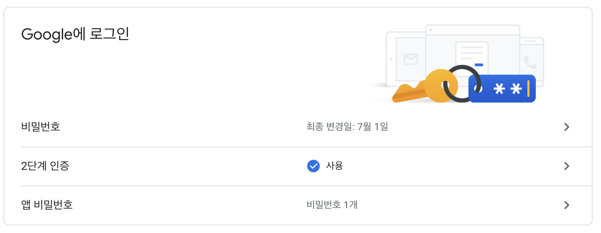
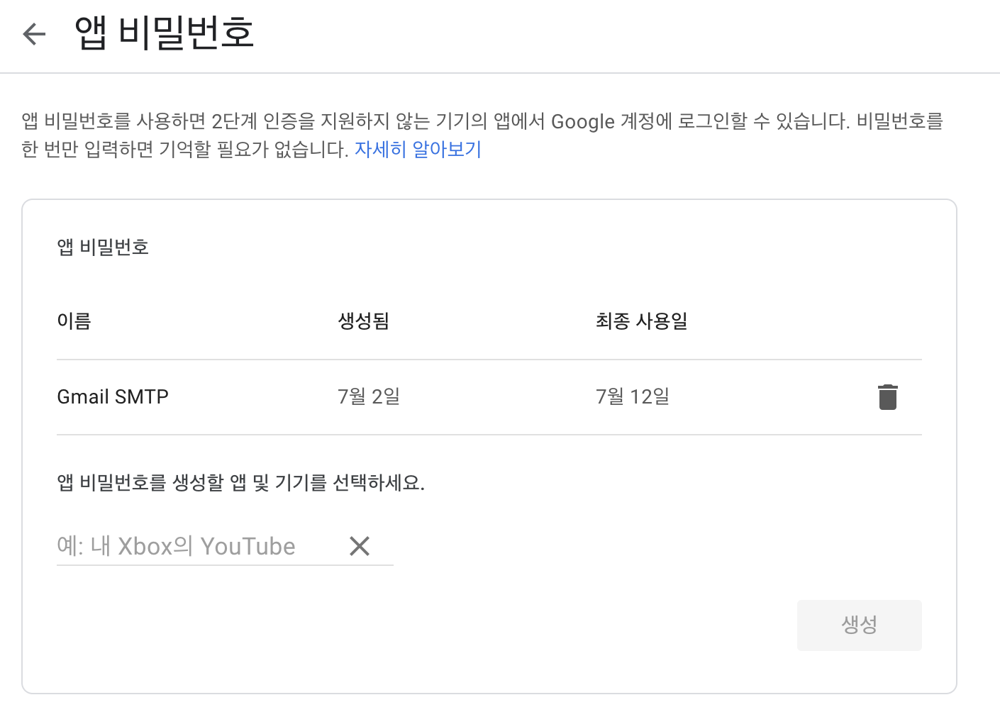
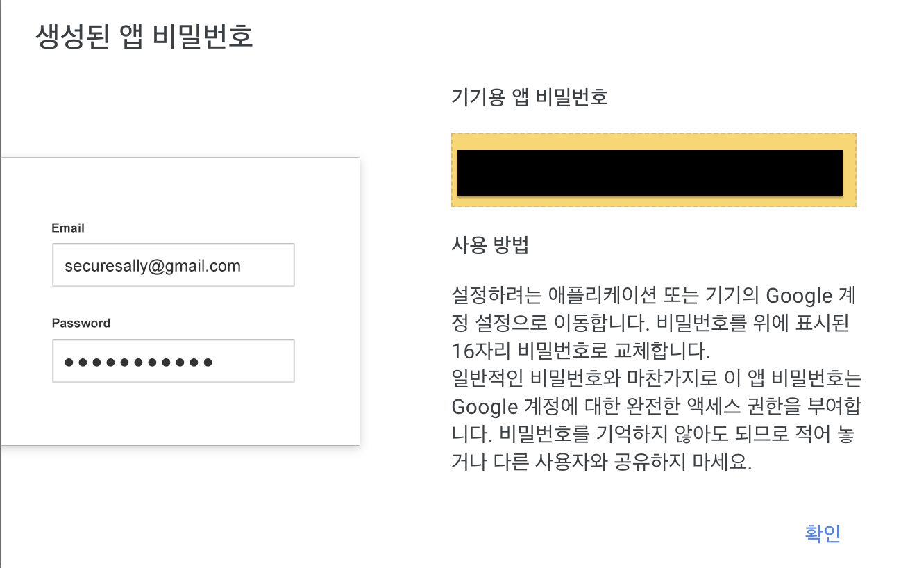

## SMTP란?
Simple Mail Transfer Protocol의 약자로 이메일을 송수신할 때 사용되는 프로토콜이다. SMTP 서버를 통해 메일을 보낼 수 있는데 여기서는 구글 메일 서버를 이용하기 위해 구글 게정이 필요하다.

## 구글 계정 설정
기존 구글 메일 서버를 이용하기 위해서는 구글 계정에서 보안 설정이 낮은 앱 허용을 변경해주면 되는데 2022 5월 30일부로 지원하지 않는다. 따라서 몇가지 설정을 추가로 해줘야한다.

### 구글 계정 로그인 및 보안 설정

2단계 인증과 앱 비밀번호를 생성해주면 된다.

### 2단계 인증

### 앱 비밀번호 생성

기기용 앱 비밀번호를 properties 파일에 사용해야한다.

## Spring 설정
build.gradle에 의존성 추가
~~~
implementation 'org.springframework.boot:spring-boot-starter-mail'
implementation group: 'com.sun.mail', name: 'javax.mail', version: '1.4.7'
implementation group: 'org.springframework', name: 'spring-context-support', version: '5.2.6.RELEASE'
~~~

application-email.properties에 설정
~~~
spring.mail.host=smtp.gmail.com
spring.mail.port=587
spring.mail.username=사용할 구글 계정
spring.mail.password=앱 비밀번호
spring.mail.properties.mail.smtp.auth=true
spring.mail.properties.mail.smtp.starttls.enable=true
spring.mail.properties.mail.smtp.starttls.required=true
~~~

* Gmail은 기본적으로 이메일을 전송할 때 항상 `TLS`로 연결하려고 한다.
* TLS 포트 번호는 587

## EmailConfig 클래스
~~~java
@Configuration
@PropertySource("classpath:application-email.properties")
public class EmailConfig {

    @Value("${spring.mail.port}")
    private int port;
    @Value("${spring.mail.properties.mail.smtp.auth}")
    private boolean auth;
    @Value("${spring.mail.properties.mail.smtp.starttls.enable}")
    private boolean starttls;
    @Value("${spring.mail.properties.mail.smtp.starttls.required}")
    private boolean starttls_required;

    @Value("${spring.mail.username}")
    private String email;
    @Value("${spring.mail.password}")
    private String password;

    @Bean
    public JavaMailSender javaMailService() {
        JavaMailSenderImpl javaMailSender = new JavaMailSenderImpl();
        javaMailSender.setHost("smtp.gmail.com");
        javaMailSender.setUsername(email);
        javaMailSender.setPassword(password);
        javaMailSender.setPort(port);
        javaMailSender.setJavaMailProperties(getMailProperties());
        javaMailSender.setDefaultEncoding("UTF-8");
        return javaMailSender;
    }
    private Properties getMailProperties() {
        Properties pt = new Properties();
        pt.put("mail.smtp.auth", auth);
        pt.put("mail.smtp.starttls.enable", starttls);
        pt.put("mail.smtp.starttls.required", starttls_required);
        pt.put("mail.smtp.ssl.protocols", "TLSv1.2");
        return pt;
    }
}
~~~

## EmailService 인터페이스
~~~java
public interface EmailService {
    String sendSimpleMessage(String to)throws Exception;
}
~~~

## EmailServiceImpl 클래스
~~~java
@Service
public class EmailServiceImpl implements EmailService{

    JavaMailSender emailSender;

    //이메일 형식 세팅
    private MimeMessage createMessage(String to)throws Exception{

        MimeMessage  message = emailSender.createMimeMessage();

        message.addRecipients(RecipientType.TO, to);//보내는 대상
        message.setSubject("제목으로 사용할 텍스트");//제목
        message.setText("보낼 내용");//내용
        message.setFrom(new InternetAddress("보내는 이메일 계정","보내는 사람 이름"));//보내는 사람

        return message;
    }

    //전송 메소드
    @Override
    public void sendSimpleMessage(String to)throws Exception {
        // TODO Auto-generated method stub
        MimeMessage message = createMessage(to);
        try{//예외처리
            emailSender.send(message);
        }catch(MailException es){
            es.printStackTrace();
            throw new IllegalArgumentException();
        }
    }
}
~~~

## Controller
~~~java
@RestController
@RequiredArgsConstructor
public class Controller {

    private final EmailServiceImpl emailServiceImpl;

    @PostMapping("/mailConfirm")
    public void emailSend(@RequestBody String email) throw Exception {
        
        emailServiceImpl.sendSimpleMessage(email);
    }
}
~~~