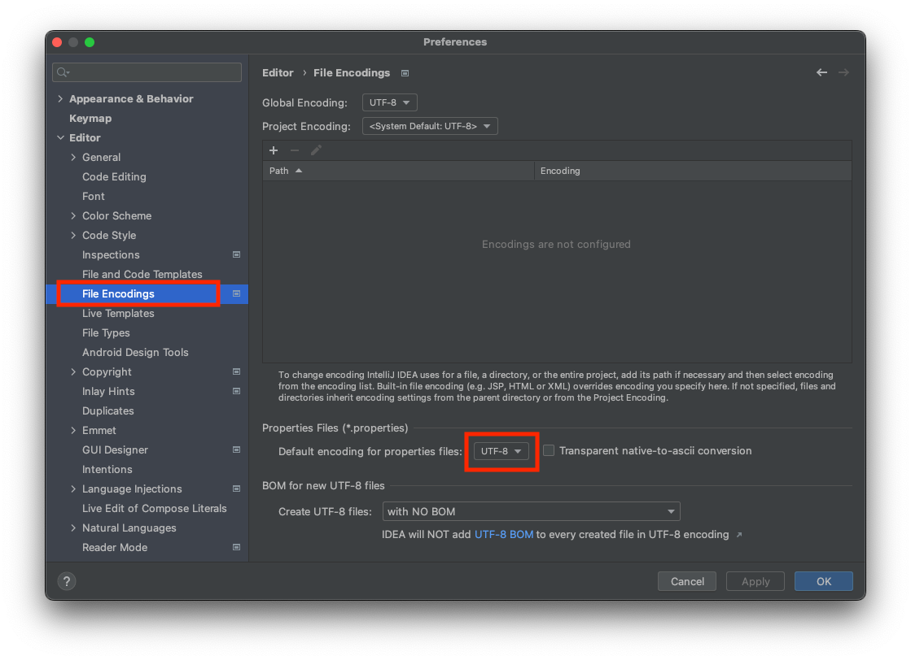
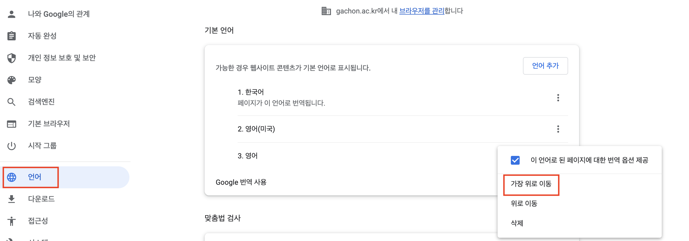

## 메세지
만약 화면에 보이는 문구를 고치려면 어떻게 해야될까? 특정 단어를 수정하려면 하드코딩 되어있는 HTML 파일에서 단어를 찾아 하나씩 수정해야 된다. 화면 수가 수십, 수백개가 넘어가면 수정하는데 사용하는 시간이 많이 발생된다.  
이러한 문제를 해결하고자 다양한 메세지를 **한 곳**에서 관리하도록하는 `메세지 기능`이 있다.  
message.properties
```
item=상품
item.id=상품 ID
item.itemName=상품명
item.price=가격
item.quantity=수량
```

message.properties에 Key-Value로 저장해두고 HTML에서 해당 데이터의 Key를 사용해 값을 불러오면 된다.
```html
<label th:text="#{item.itemName}"></label>
```

> Thymeleaf 문법인 `#{}`을 사용하면 properties에 저장되어있는 값을 불러올 수 있다.

## 국제화
다른 나라에서 웹 사이트에 접속을 할 경우 해당 국가에 맞는 언어로 제공하는 것이 `국제화 기능`이다.  
message_en.properties
```
item=Item
item.itemName=Item Name
item.price=Price
item.quantity=Qauntity
```

message_ko.properties
```
item=상품
item.id=상품 ID
item.itemName=상품명
item.price=가격
item.quantity=수량
```
메세지 파일을 국가별로 생성하고 영어를 사용하는 사용자면 message_en.properties, 한국어를 사용한다면 message_ko.properties 파일을 사용하게 개발하면 된다.  
어느 국가에서 접속했는지 확인하는 방법은 HTTP 헤더에 `accept-language` 헤더 값을 사용하거나 사용자가 직접 선택하도록 하고, 쿠키 등을 사용해서 처리하면 된다.

## 스프링 메시지 소스 설정
스프링은 기본적인 메시지 관리 기능을 제공한다.  
* `MessageSource`: 메시지 관련 **인터페이스**
* `ResourceBundleMessageSource`: MessageSource의 **구현체**
구현체인 ResourceBundelMessageSource를 스프링 빈으로 등록하면 된다.
```java
@Bean
public MessageSource ms() {
    ResourceBundelMessageSource messageSource = new ResourceBundelMessageSource();
    messageSource.setBasenames("messages", "error");
    messageSource.setDefaultEncoding("UTF-8");
    return messageSource;
}
```

* setBasenames: 설정 파일의 이름을 지정 [파일이름]_[언어코드]_[국가코드].properties
  * ex) messages_en_uk.properties
  * 여러개 파일을 한번에 지정 가능
* setDefaultEncoding: 인코딩 정보 지정한다.

## 스프링 부트 메시지 소스 설정
스프링 부트를 사용하면 스프링 부트가 MessageSource를 자동으로 스프링 빈으로 등록한다.
application.properties
```
spring.messages.basename=messages, config.i18n.messages;
```
MessageSource를 스프링 빈으로 등록하지 않고, 스프링 부트와 관련된 별도의 설정을 하지 않으면 messages라는 이름으로 기본 등록이 된다.  
messages_en.properties, messages_ko.properties 등 파일을 생성하면 자동으로 인식된다. 파일 위치는 **/resources/messages.properties**

> i18n은 Internationalization의 i와 n사이에 18개의 알파벳이 있다는 뜻

messages.properties
```
hello=안녕
hello.name=안녕 {0}
```
messages_en.properties
```
hello=hello
hello.name=hello {0}
```
## 스프링 메시지 소스 사용
MessageSource 인터페이스
```java
public interface MessageSource {
    String getMessage(String code, @Nullable Object[] args, @Nullable String defaultMessage, Locale locale);
    String getMessage(String code, @Nullable Object[] args, Locale locale) throws NoSuchMessageException;
}
```
code를 포함인 일부 파라미터로 메시지를 읽어오는 기능을 제공한다.

```java
@SpringBootTest
public class MessageSourceTest {

    @Autowired
    MessageSource ms;

    @Test
    void helloMessage() {
        String result = ms.getMessage("hello", null, null);

        assertThat(result).isEqualTo("안녕");
    }

    @Test
    void notFoundMessageCode() {
        //메시지가 없으면 NoSuchMessageException 발생
        assertThatThrownBy(() -> ms.getMessage("no_code", null, null))
                .isInstanceOf(NoSuchMessageException.class);
    }

    @Test
    void notFoundMessageDefaultMessage() {
        //기본 메시지를 설정하면 메시지가 없는 경우 기본 메시지 반환
        String result = ms.getMessage("no_code", null, "기본 메세지", null);
        assertThat(result).isEqualTo("기본 메세지");
    }

    @Test
    void argumentMessage() {
        //매개변수 사용 hello.name=안녕 {0}에서 {0} 자리에 spring이 전달됨
        String result = ms.getMessage("hello.name", new Object[]{"spring"}, null);
        assertThat(result).isEqualTo("안녕 spring");
    }

    @Test
    void defaultLang() {
        assertThat(ms.getMessage("hello", null, null)).isEqualTo("안녕");
        //Locale 정보를 기반으로 국제화 파일을 선택한다.
        //구제적인 정보부터 찾고, 없으면 디폴트를 선택 ex) messages_en_us -> messages_en -> messages
        assertThat(ms.getMessage("hello", null, Locale.KOREA)).isEqualTo("안녕");
    }

    @Test
    void enLang() {
        assertThat(ms.getMessage("hello", null, Locale.ENGLISH)).isEqualTo("hello");
    }
}
```

> Locale 정보가 없는 경우 `Locale.getDefault()`를 호출해서 기본 시스템 Locale를 사용한다. 한국으로 설정 되어있다면 messages_ko.properties를 찾고 없으면 messages.properties 조회

만약 테스트 실행 후 except가 ???으로 나온다면 IntelliJ 프로젝트 설정에 들어가 file encoding에서 utf-8로 변경하면 된다.
 <div></div>

## 타임리프 메시지 적용
messages.properties
```
label.item=상품
label.item.id=상품 ID
label.item.itemName=상품명
```

messages_en.properties
```
label.item=Item
label.item.id=Item ID
label.item.itemName=Item Name
```

타임리프의 메시지 표현식 `#{}`을 사용하면 스프링의 미시지를 편하게 조회할 수 있다.
```html
<div th:text="{label.item}"></div>
↓
<div>상품</div>
```

영어 메시지가 적용되는걸 확인하려면 크롬 설정에 들어가 언어에서 영어를 가장 위로 이동시키고 확인하면 된다.
<div></div>

## LoacaleResolver
스프링은 Locale 선택 방식을 변경할 수 있도록 `LocaleResolver`라는 인터페이스를 제공하는데, 스프링 부트는 기본으로 **Accept-Language**를 활용하는 `AcceptHeaderLocaleResolver`를 사용한다.
```java
public interface LocaleResolver {
    Locale resolveLocale(HttpServletRequest request);
    void setLocale(HttpServletRequest request, @Nullable HttpServletResponse response, @Nullable Locale locale);
}
```
Locale 선택방식을 변경하려면 LocaleResolver의 구현체를 변경해서 사용하면 된다. 필요하면 검색해서 샤용해보자.