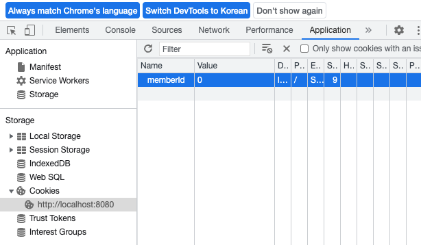
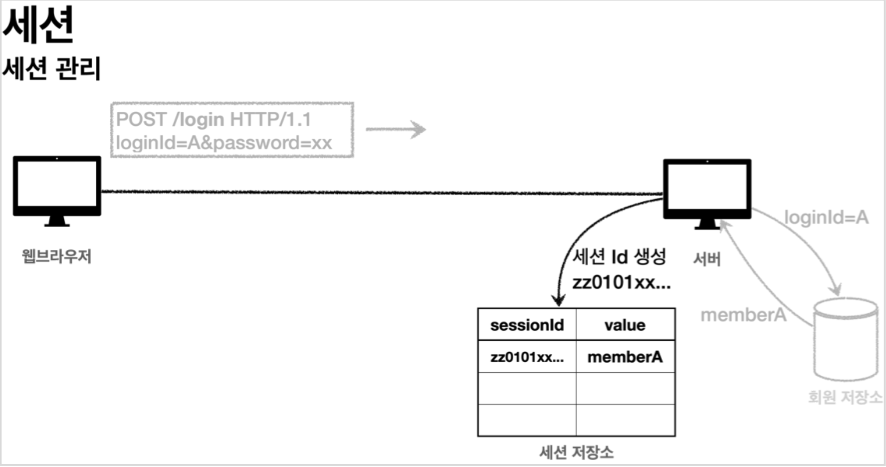
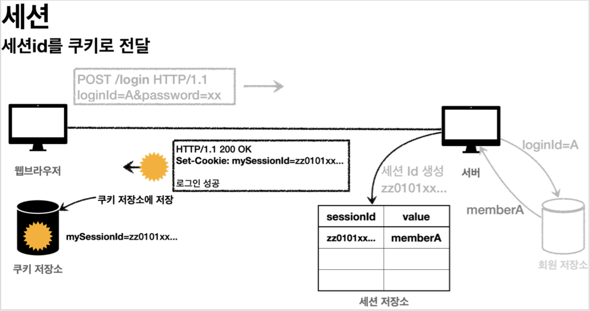
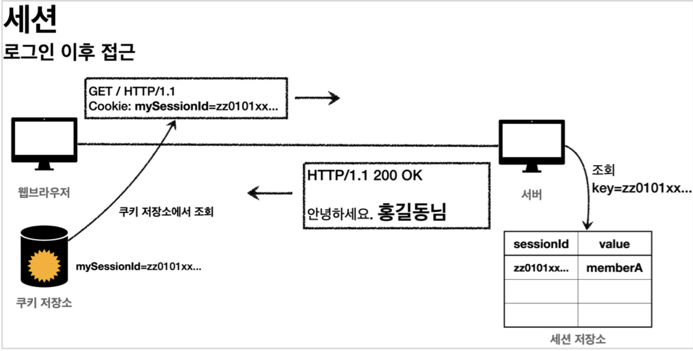

## 쿠키
쿠키에 관한 내용은 [HTTP 헤더 부분](https://rkdejr2321.github.io/http/HTTP_header)을 참고하면 된다.  
쿠키 객체를 만들어 사용하면 된다.
```java
@PostMapping("/login")
public String login(@Valid @ModelAttribute("loginForm") LoginForm loginForm, 
                    BindingResult bindingResult, HttpServletResponse response) {
    
    if (bindingResult.hasErrors()) {
        return "login/loginForm";
    }

    Member loginMember = loginService.login(loginForm.getLoginId(), loginForm.getPassword());

    if (loginMember == null) {
        bindingResult.reject("loginFail", "아이디 또는 비밀번호가 맞지 않습니다.");
        return "login/loginForm";
    }

    //로그인 성공 처리 TODO

    //쿠키에 시간 정보를 주지 않으면 세션 쿠키(웹 브라우저 종료시 모두 종료)
    Cookie idCookie = new Cookie("memberId", String.valueOf(loginMember.getId()));
    response.addCookie(idCookie);

    return "redirect:/";
}

@PostMapping("logout")
public String logout(HttpServletResponse response) {
    Cookie cookie = new Cookie("memberId", null);
    cookie.setMaxAge(0);
    response.addCookie(cookie);
    return "redirect:/";
}


```
로그인에 성공하면 쿠키 이름과 값을 지정하여 쿠키를 생성하고 **HttpServeltResponse에 담는다. 웹 브라우저는 종료 전까지 쿠키에 담아있는 값을 서버에 계속 보내준다.  
로그아웃 시 쿠키의 종료 날짜를 0으로 지정하면 해당 쿠키는 즉시 종료된다.  
쿠키를 조회하려면 `@CookieValue`를 사용하면 된다.
```java
@GetMapping("/")
public String homeLogin(@CookieValue(name = "memberId", required = false) Long memberId, Model model) {

    if (memberId == null) {
        return "home";
    }

    //로그인
    Member loginMember = memberRepository.findById(memberId);
    if (loginMember == null) {
        return "home";
    } else {
        model.addAttribute("member", loginMember);
        return "loginHome";
    }
}
```

로그인을 하지 않은 사용자(쿠키의 값이 null)가 접근하면 home 화면을 보내주고 로그인 한 사용자(쿠키 값이 존재)가 접근하면 회원 관련 정보를 보여주기 위해 member를 모델에 담아서 전달해준다.

### 쿠키와 보안 문제
* 쿠키 값은 임의로 변경할 수 있다.
  * 웹 브라우저 개발자 모드 -> Application -> Cookies에서 쿠키 값을 확인할 수 있다.
  * value의 값을 임의로 변경하여 요청하면 다른 사용자가 된다.
<div></div>

* 쿠키에 개인정보나 신용카드 정보 같은 유출되어서 안되는 정보가 있다면 훔쳐갈 수 있다.
* 한번 해킹한 쿠키로 악의적인 요청을 계속 시도할 수 있다.

이런 문제를 해결하기 위해 몇가지 방법이 있다.
* 쿠키에는 예측 불가능한 임의의 토큰(랜덤 값)을 넣어두고 서버에서 값과 데이터를 매핑해 사용하고 서버에서 토큰을 관리한다.
* 토큰을 탈취해도 시간이 지나면 사용하지 못하도록 서버에서 만료 시간을 짧게 유지하거나 해킹이 의심되면 해당 토큰을 강제로 제거한다.

## 세션
### 세션의 동작 방식
아이디와 비밀번호가 요청으로 서버에 들어오면 해당 사용자가 맞는지 확인하고 맞으면 추정 불가능한 **세션ID**를 생성해 세션 저장소에 보관할 값과 함께 보관한다.  
UUID는 중복될 가능성이 극히 희박해 추정 불가능하다.
<div></div>

서버는 클라이언트에 세션ID만 쿠키에 담아서 전달한다. 즉, 중요한 정보는 클라이언트에 전달되지 않는다.
<div></div>

클라이언트는 요청시 세션ID가 담겨있는 쿠키를 전달하고 요청 받은 서버는 세션 저장소에서 세션ID를 조회해 보관한 값을 사용한다.
<div></div>

### 직접 세션 만들기
세션의 기능은 3가지다.
* 세션 생성
  * 세션 저장소에 추정 불가능한 값을 생성해 세션 저장소에 저장하고 응답 쿠키를 생성해 클라이언트에 전달
* 세션 조회
  * 클라이언트가 요청한 쿠키의 값으로 세션 저장소에 보관한 값 조회
* 세션 만료
  * 클라이언트가 요청한 쿠키의 값으로 세션 저장소에 보관한 값과 ID 제거

```java
/**
 * 세션 관리
 */
@Component
public class SessionManager {

    public static final String Session_COOKIE_NAME = "mySessionId";
    private Map<String, Object> sessionStore = new ConcurrentHashMap<>();

    /**
     * 세션 생성
     */
    public void createSession(Object value, HttpServletResponse response) {

        //세션 id 생성하고, 값을 세션에 저장
        String sessionId = UUID.randomUUID().toString();
        sessionStore.put(sessionId, value);

        //쿠키 생성
        Cookie mySessionCookie = new Cookie(Session_COOKIE_NAME, sessionId);
        response.addCookie(mySessionCookie);

    }

    /**
     * 세션 조회
     */
    public Object getSession(HttpServletRequest request) {
        Cookie sessionCookie = findCookie(request, Session_COOKIE_NAME);
        if (sessionCookie == null) {
            return null;
        }

        return sessionStore.get(sessionCookie.getValue());
    }

    /**
     * 세션 만료
     */
    public void expire(HttpServletRequest request) {
        Cookie sessionCookie = findCookie(request, Session_COOKIE_NAME);
        if (sessionCookie != null) {
            sessionStore.remove(sessionCookie.getValue());
        }
    }

    /*
     * 세션 저장소 조회 메서드
    */
    public Cookie findCookie(HttpServletRequest request, String cookieName) {
        Cookie[] cookies = request.getCookies();
        if (cookies == null) {
            return null;
        }

        return Arrays.stream(cookies)
                .filter(cookie -> cookie.getName().equals(cookieName))
                .findAny()
                .orElse(null);
    }
}

```

```java
@GetMapping("/")
public String homeLoginV2(HttpServletRequest request, Model model) {

    //세션 관리자에 저장된 회원 정보 조회
    Member member = (Member) sessionManager.getSession(request);


    //로그인
    if (member == null) {
        return "home";
    } else {
        model.addAttribute("member", member);
        return "loginHome";
    }
}

@PostMapping("logout")
public String logoutV2(HttpServletRequest request) {
    sessionManager.expire(request);
    return "redirect:/";
}
```

### 서블릿 HTTP 세션
쿠키와 세션의 개념을 이해 하기 위해 직접 만들었다. 세션은 특별한 기술이 아니라 쿠키를 사용하는데 서버에서 데이터를 유지하는 방법이라고 이해하면 된다. 그런데 프로젝트마다 세션을 직접 개발하는 것은 상당히 번거롭다.  
서블릿이 공식으로 지원하는 `HttpSession`을 사용하면 직접 만든 방식과 별다른 차이점이 없을 뿐더러 세션을 일정시간 사용하지 않으면 해당 세션을 삭세하는 기능을 제공한다. 쿠키의 이름은 **JSESSIONID**이고 값은 추정 불가능한 랜덤 값이다.
```java
@PostMapping("/login")
public String loginV3(@Valid @ModelAttribute("loginForm") LoginForm loginForm, 
                      BindingResult bindingResult, HttpServletRequest request) {
    
    if (bindingResult.hasErrors()) {
        return "login/loginForm";
    }

    Member loginMember = loginService.login(loginForm.getLoginId(), loginForm.getPassword());

    //로그인 실패
    if (loginMember == null) {
        bindingResult.reject("loginFail", "아이디 또는 비밀번호가 맞지 않습니다.");
        return "login/loginForm";
    }

    //로그인 성공 처리
    //세션이 있으면 있는 세션을 반환, 없으면 신규 세션을 생성
    HttpSession session = request.getSession();
    session.setAttribute(SessionConst.LOGIN_MEMBER, loginMember);

    return "redirect:/";
}

@PostMapping("logout")
public String logoutV3(HttpServletRequest request) {
    HttpSession session = request.getSession(false);
    if (session != null) {
        session.invalidate();
    }
    return "redirect:/";
}
```

* `request.getSession()`: 세션을 생성하고 조회
  * getSession(**true**): 세션이 있으면 기존 세션을 반환하고 세션이 없으면 새로운 세션을 생성해서 반환
  * getSession(**false**): 세션이 있으면 기존 세션을 반환하고 세션이 없으면 생성하지 않고 **null**반환
  * getSession()과 getSession(true)는 동일하다

* `session.setAttribute(Session.LOGIN_MEMBER, loginMember)`: 세션에 데이터를 보관. 하나의 세션에 어려 값을 저장할 수 있다.
* `session.invalidate()`: 세션 제거

### @SessionAttibute
스프링은 세션을 더 편리하게 사용할 수 있도록 `@SessionAttribute`를 지한다.  

세션을 사용해서 로그인 된 사용자를 찾으려면 세션을 조회해서 null 값인지 체크하면 된다.  
기존 코드
```java
@GetMapping("/")
public String homeLoginV3(HttpServletRequest request, Model model) {

    HttpSession session = request.getSession(false);
    if (session == null) {
        return "home";
    }

    Member loginMember = (Member) session.getAttribute(SessionConst.LOGIN_MEMBER);

    //세션에 회원 데이터가 없으면 home
    if (loginMember == null) {
        return "home";
    }

    //세션이 유지되면 로그인으로 이동
    model.addAttribute("member", loginMember);
    return "loginHome";

}
```

@SessionAttribute 사용 코드
```java
@GetMapping("/")
public String homeLoginV3Spring(
    @SessionAttribute(name = SessionConst.LOGIN_MEMBER, required = false) Member loginMember, Model model) {

    //세션에 회원 데이터가 없으면 home
    if (loginMember == null) {
        return "home";
    }

    //세션이 유지되면 로그인으로 이동
    model.addAttribute("member", loginMember);
    return "loginHome";

}
```
코드가 간결해진 걸 확인할 수 있다.  

만약 로그인을 처음 시도 했다면 URL 뒤에 jsessionid=... 값이 붙어있는걸 확인할 수 있다. 웹 브라우저가 쿠키를 지원하지 않을 때 URL을 통해서 세션을 유지 했는데 모든 요청 URL에 이 값을 붙여서 전달해야 한다. 서버 입장에서는 웹 브라우저가 쿠키를 지원하는지 안하는지 최초에는 판단하지 못하므로 쿠키도 전달하고 jsessionid도 함께 전달한다.  
항상 쿠키를 통해서 세션을 유지하고 싶으면 applicatoin.properties에 옵션을 설정하면 된다.
```properties
server.servlet.session.tracking-modes=cookie
```

### 세션 정보
세션이 제공하는 정보를 확인할 수 있다.
```java
@RestController
@Slf4j
public class SessionInfoController {

    @GetMapping("/session-info")
    public String sessionInfo(HttpServletRequest request) {
        
        HttpSession session = request.getSession(false);
        if (session == null) {
            return "세션이 없습니다.";
        }

        //세션 데이터 출력
        session.getAttributeNames().asIterator()
                .forEachRemaining(name -> log.info("session name={}. values={}", name, session.getAttribute(name)));

        log.info("sessionId={}", session.getId());
        log.info("getMaxInactiveInterval={}", session.getMaxInactiveInterval());
        log.info("createTime={}", session.getCreationTime());
        log.info("createTime={}", new Date(session.getLastAccessedTime()));
        log.info("isNew={}", session.isNew());

        return "세션 출력";
    }
}
```

* `sessionId()` : 세션Id, JSESSIONID 의 값이다. 예) 34B14F008AA3527C9F8ED620EFD7A4E1
* `maxInactiveInterval()` : 세션의 유효 시간, 예) 1800초, (30분)
* `creationTime()` : 세션 생성일시
* `lastAccessedTime()` : 세션과 연결된 사용자가 최근에 서버에 접근한 시간, 클라이언트에서 서버로 sessionId ( JSESSIONID )를 요청한 경우에 갱신된다.
* `isNew()` : 새로 생성된 세션인지, 아니면 이미 과거에 만들어졌고, 클라이언트에서 서버로 sessionId ( JSESSIONID )를 요청해서 조회된 세션인지 여부

### 세션 타임아웃 설정
세션 종료는 사용자가 로그아웃을 직접 호출해서 session.invalidate()가 호출되어야 삭제가 된다. 그러나 대부분의 사용자들은 로그아웃 버튼을 누르는 것 보다 브라우저를 종료한다. 문제는 HTTP는 요청과 응답때 쓰이기 때문에 서버 입장에서 브라우저가 종료 되었는지 확인할 방법이 없다. 세션을 무한정 보관하면 문제가 발생할 수 있다.
* 세션과 관련된 쿠키를 탈취 당했을 경우 오랜 시간이 지나도 사용 가능하기 때문에 악의적인 요청을 할 수 있다.
* 새션은 **메모리**에 생성된다. 수많은 세션이 메모리에 누적되면 장애가 발생할 수 있다.

세션의 종료 시점은 생성 시점으로부터 30분 정도면 된다고 생각하자. 그러면 30분마다 세션이 삭제되기 때문에 30분마다 로그인을 해야되는 번거로움이 있다.   
사용자가 최근에 요청한 시간을 기준으로 30분 정도를 유지시켜주면 사용자는 서비스를 이용할 때 마다 세션의 생존 시간은 30분으로 계속 늘어나게 된다. HttpSession은 이런 방식을 사용한다.

스프링 부트로 글로벌 설정
```properties
#글로벌 설정은 분 단위로 설정 60, 120...
server.servlet.session.timeout=60 #60초(1분)
```

특정 세션 단위로 설정
```java
session.setMaxInactiveInterval(1800) //1800초
```

세션의 타임아웃 시간은 해당 세션과 관련된 JSESSIONID를 전달하는 HTTP 요청이 있으면 현재 시간으로 초기화 된다. sessiongetLastAccessedTime()으로 확인할 수 있는데 이 시간 이후로 설정한 타임아웃 시간이 지나면 WAS가 내부에서 해당 세션을 제거한다.

> 주의할 점은 세션에서는 메모리를 위해 최소한의 데이터만 보관하고 유지 시간을 적절하게 설정해야 한다. 기본은 30분 