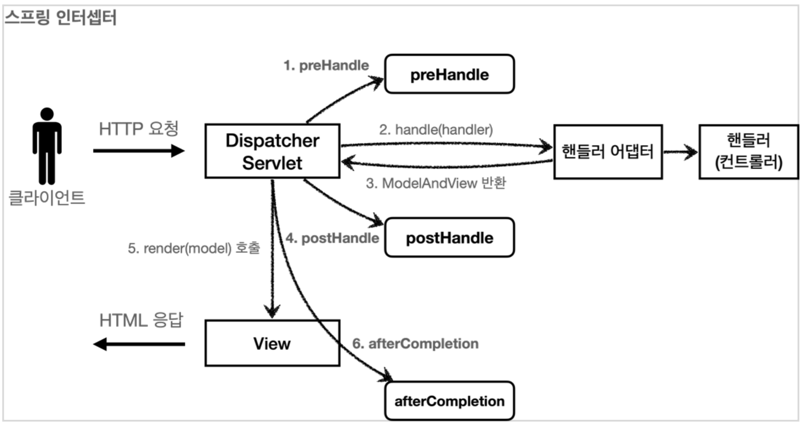
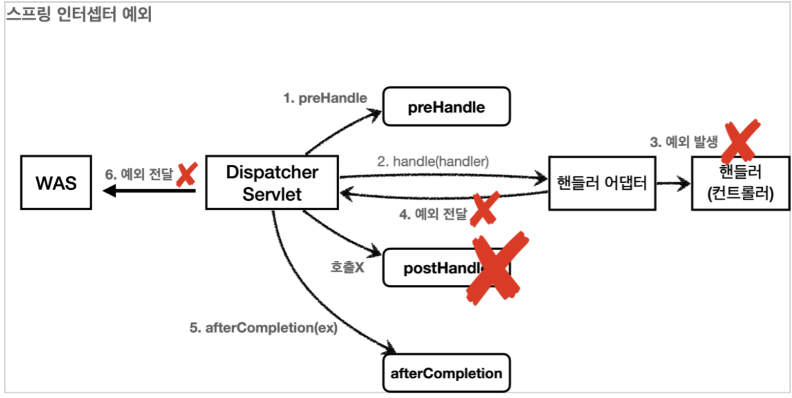

## 인터셉터
스프링이 MVC가 제공하는 기술인 `인터셉터`도 필터와 마찬가지로 웹과 관련된 공통 관심 사항을 해결할 수 있는 기술이다. 

### 스프링 인터셉터 흐름
```
HTTP 요청 -> WAS -> 필터 -> 서블릿 -> 스프링 인터셉터 -> 컨트롤러
HTTP 요청 -> WAS -> 필터 -> 서블릿 -> 스프링 인터셉터(적절하지 않은 요청이면 컨트롤러 호출X)
```
* 스프링 인터셉터는 디스패처 서블릿과 컨트롤러 사이에서 컨트롤러 호출 직전에 호출 된다.
* 스프링 인터셉터에도 URL 패턴을 적용할 수 있는데, 서블릿 URL 패터노가는 다르고, 매우 정밀하게 설정할 수 있다.

```
HTTP 요청 -> WAS -> 필터 -> 서블릿 -> 인터셉터1 -> 인터셉터2 -> 컨트롤러
```
스프링 인터셉터도 체인으로 구성되는데 중간에 인터셉터를 추가하여 여러 인터셉터를 적용할 수 있다.

### 스프링 인터셉터 인터페이스
```java
public interface HandlerInterceptor {

    default boolean preHandle(HttpServletRequest request, HttpServletResponse response, Object Handler) throws Eception{}

    default boolean postHandle(HttpServletRequest request, 
                               HttpServletResposne response, 
                               Object Handler, @Nullable ModelAndView modelAndView) throws Exception{}

    default boolean afterCompletion(HttpServletRequest request, 
                                    HttpServletResposne response, 
                                    Object Handler, @Nullable Exception ex) throws Exception{}
}
```
* `preHandle`: 컨트롤러 호출 전 실행되는 메서드로 true면 다음으로 진행, false를 리턴하면 다음 단계를 수행하지 않는다.
* `postHandle`: 컨트롤러가 정상 호출 후 실행되는 메서드
* `afterCompletion`: 뷰가 클라이언트에 응답을 전송한 뒤에 실행되는 메서드

### 인터셉터 흐름
<div></div>

### 인터셉터 예외
<div></div>

> afterComletion은 예외가 발생해도 호출된다.  
> 예외가 발생하면 postHandle()은 호출되지 않으므로 예외와 무관하게 공통 처리를 하려면 afterCompletion()을 사용


## 스프링 인터셉터 - 요청 로그
```java
@Slf4j
public class LogInterceptor implements HandlerInterceptor {

    public static final String LOG_ID = "logId";

    @Override
    public boolean preHandle(HttpServletRequest request, 
                             HttpServletResponse response, Object handler) throws Exception {

        String requestURI = request.getRequestURI();
        //요청 로그를 구분하기 위한 uuid
        String uuid = UUID.randomUUID().toString();

        request.setAttribute(LOG_ID, uuid);

        //@RequestMapping: HandlerMethod
        //정적 리소스: ResourceHttpRequestHandler
        if (handler instanceof HandlerMethod) {
            HandlerMethod hm = (HandlerMethod) handler;//호출할 컨트롤러 메서드의 모든 정보가 포함되어 있다.
        }

        log.info("REQUEST [{}][{}][{}]", uuid, requestURI, handler);
        return true;

    }

    @Override
    public void postHandle(HttpServletRequest request, 
                           HttpServletResponse response, 
                           Object handler, ModelAndView modelAndView) throws Exception {
        log.info("postHandler [{}]", modelAndView);
    }

    @Override
    public void afterCompletion(HttpServletRequest request, 
                                HttpServletResponse response, 
                                Object handler, Exception ex) throws Exception {

        String requestURI = request.getRequestURI();

        String logId = (String)request.getAttribute(LOG_ID);

        log.info("RESPONSE [{}][{}][{}]", logId, requestURI, handler);
        if (ex != null) {
            log.error("afterCompletion error!!", ex);
        }
    }
}
```

* HandlerMethod: @Controller나 @RequestMapping을 사용하는 경우 핸들러 정보로 넘어온다.
* ResourceHttpRequestHandler: 정적 리소스가 호출되는 경우 핸들러 정보로 넘어온다.

인터셉터 역시 스프링 설정에 등록해야 적용 가능하다. WebMvcConfigure가 제공하는 `addInterceptor()`를 사용해서 등록하면 된다.
```java
@Configuration
public class WebConfig implements WebMvcConfigurer {

    @Override
    public void addInterceptors(InterceptorRegistry registry) {
        registry.addInterceptor(new LogInterceptor())
                .order(1)
                .addPathPatterns("/**")
                .excludePathPatterns("/css/**", "/*.ico", "/error");
    }
}
```

* `registry.addInterceptor()`: 인터셉터 등록.
* `order()`: 인터셉터를 적용할 순서를 지정. 낮을 수록 먼저 호출된다.
* `addPathPattern`: 인터셉터를 적용할 URL 패턴 지정.
* `excludePathPattern`: 인터셉터를 제외할 패턴을 지정.

필터와 비교해보면 인터셉터는 매우 정밀하게 URL 패턴을 지정할 수 있다.
```
? 한 문자 일치
* 경로(/) 안에서 0개 이상의 문자 일치
** 경로 끝까지 0개 이상의 경로(/) 일치

ex)
/page/t?st.html -> /page/test.html, /page/tXst.html
/page/*.png -> /page 하위에 있는 파일중 .png로 끝나는 파일
/page/** -> /page 하위에 있는 모든 파일
```
더 자세한 내용은 [공식 문서](https://docs.spring.io/spring-framework/docs/current/javadoc-api/org/springframework/web/util/pattern/PathPattern.html)를 참고

## 스프링 인터셉터 - 인증 체크
로그인 체크를 하려면 컨트롤러가 호출 되기 전에 확인해서 로그인 한 사용자면 호출한 컨트롤러를 실행하고 아니라면 별도 로직으로 처리해주면 된다.
```java
@Slf4j
public class LoginCheckInterceptor implements HandlerInterceptor {

    @Override
    public boolean preHandle(HttpServletRequest request, HttpServletResponse response, Object handler) throws Exception {

        String requestURI = request.getRequestURI();

        log.info("인증 체크 인터셉터 실행 {}", requestURI);

        HttpSession session = request.getSession();

        if (session == null || session.getAttribute(SessionConst.LOGIN_MEMBER) == null) {
            log.info("미인증 사용자 요청");

            response.sendRedirect("/login?redirectURL=" + requestURI);
            return false;
        }

        return true;
    }
}
```java
@Configuration
public class WebConfig implements WebMvcConfigurer {

    @Override
    public void addInterceptors(InterceptorRegistry registry) {
        registry.addInterceptor(new LogInterceptor())
                .order(1)
                .addPathPatterns("/**")
                .excludePathPatterns("/css/**", "/*.ico", "/error");

        registry.addInterceptor(new LogInterceptor())
                .order(2)
                .addPathPatterns("/**")
                .excludePathPatterns("/", "/members/add", "/login", "/logout", "/css/**", "/*.ico", "/error");
    }
}
```

기본적으로 모든 경로에 로그인을 체크하게 설정해두고 로그인이 꼭 필요하지 않은 특정 URL만 인터셉터를 제외하면 된다. 서블릿 필터와 비교하면 매우 편리하게 사용 가능하다.  
결론적으로 서블릿 필터와 인터셉터 모두 웹과 관련된 공통 관심사를 처리하는 기술이지만 스프링을 사용하고 특별한 이유가 없으면 인터셉터를 사용하자.