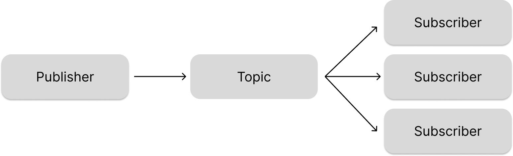

## STOMP
Simple Text Oriented Message Protocol의 약자로 효율적인 메세지 전송을 위한 프로토콜이다.
* 클라이어트/서버 간 전송할 메세지의 유형, 형식, 내용 등을 정의한 규칙
* TCP, WebSocket과 같은 양방향 통신
* 메세지 메시지 전송, 메시지 구독, 메시지 수신 확인, 트랜잭션 관리 등의 기능을 제공
* 매우 간단하고 가볍기 때문에, 많은 언어와 플랫폼에서 지원

## Message Broker
메세지 브로커는 발신자가 보낸 메세지를 브로커가 받아 수신자에게 전달하는 중개자 역할을 한다. 이를 통해 발신자와 수신자 간의 직접적인 통신 없이도 메시지를 전송할 수 있다.  
* STOMP, MQTT, AMQP 등의 대부분의 메세지 프로토콜에서 브로커를 사용
* 메세지 브로커는 대규모 분산 시스템에서 메세지 처리를 담당
  * 시스템의 확장성과 신뢰성 제공

### Queue
발신자가 보낸 메세지를 FIFO 방식으로 처리하며 각 메세지는 하나의 수신자에게 전달된다.
<div></div>

### Topic
메세지를 구독한 모든 수신자에게 전달된다.
<div></div>

## WebSocet을 사용해 구현
### 의존성 추가
build.gradle에 Loombok과 Websocket dependency 추가
```gradle
implementation 'org.springframework.boot:spring-boot-starter-websocket'
compileOnly 'org.projectlombok:lombok'
annotationProcessor 'org.projectlombok:lombok'
```

### Model
```java
@@Data
public class ChatMessage {

    //메시지 유형
    private MessageType type;

    //메시지 내용
    private String content;

    //메시지 보내는 사람
    private String sender;

    public enum MessageType {
        CHAT, JOIN, LEAVE
    }
}
```

### WebSocket Listener
```java
@Component
public class WebSocketEventListener {

    private static final Logger logger = LoggerFactory.getLogger(WebSocketEventListener.class);

    @Autowired
    private SimpMessageSendingOperations messagingTemplate;

    @EventListener
    public void handleWebSocketConnectListener(SessionConnectedEvent event) {
        logger.info("Received a new websocket connection");
    }

    @EventListener
    public void handleWebSocketDisConnectListener(SessionDisconnectEvent event) {
        logger.info("Received a new websocket connection");

        StompHeaderAccessor headerAccessor = StompHeaderAccessor.wrap(event.getMessage());
        String username = (String) headerAccessor.getSessionAttributes().get("username");

        if (username != null) {
            logger.info("UserDisconnected:" + username);
            ChatMessage chatMessage = new ChatMessage();
            chatMessage.setType(ChatMessage.MessageType.LEAVE);
            chatMessage.setSender(username);
            messagingTemplate.convertAndSend("/topic/public", chatMessage);
        }
    }
}
```

### WebSocet Congifuration
```java
@Configuration
@EnableWebSocketMessageBroker //메시지 브로커
public class WebSocketConfig implements WebSocketMessageBrokerConfigurer {

    @Override
    public void registerStompEndpoints(StompEndpointRegistry registry) {
        registry.addEndpoint("/ws").withSockJS(); //요청 보낼 첫번째 uri
    }

    @Override
    public void configureMessageBroker(MessageBrokerRegistry registry) {
        registry.setApplicationDestinationPrefixes("/app");
        registry.enableSimpleBroker("/topic");
    }
}
```

### Controller
```java
@Controller
public class ChatController {

    //소켓 매핑
    @MessageMapping("/chat.sendMessage")
    @SendTo("/topic/public") // 브로커에 전달할 uri
    public ChatMessage sendMessage(@Payload ChatMessage chatMessage) {
        return chatMessage;
    }

    @MessageMapping("/chat.addUser")
    @SendTo("/topic/public")
    public ChatMessage addUser(@Payload ChatMessage chatMessage,
                               SimpMessageHeaderAccessor headerAccessor) {

        headerAccessor.getSessionAttributes().put("username", chatMessage.getSender());

        return chatMessage;
    }
}
```


