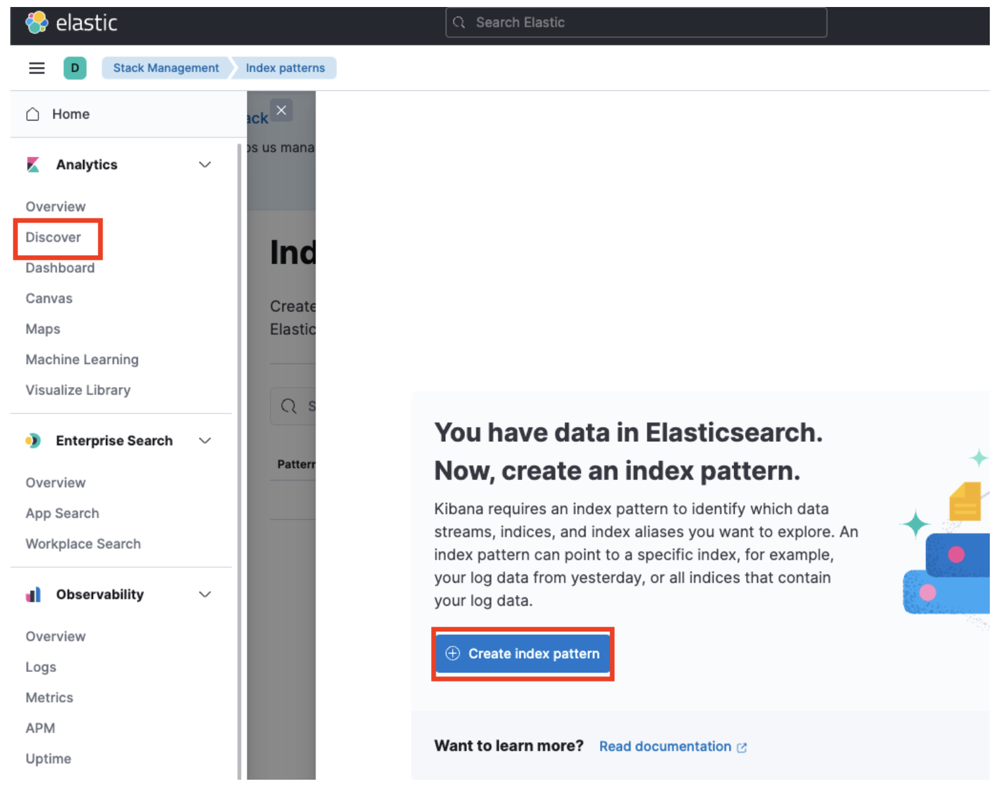
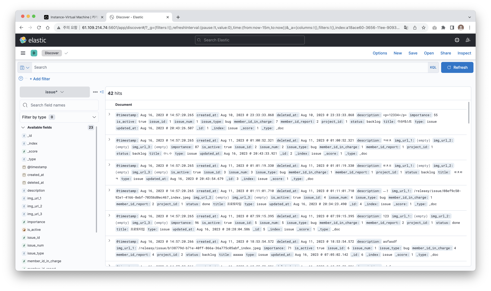

## 스프링부트에 elastcisearch 추가

```gradle
implementation 'org.springframework.boot:spring-boot-starter-data-elasticsearch'
```

## Elasticseach 설정 파일 추가
```java
@Configuration
@EnableElasticsearchRepositories
public class ElasticSearchConfig extends ElasticsearchConfiguration {

    @Override
    public ClientConfiguration clientConfiguration() {
        return ClientConfiguration.builder()
                .connectedTo("localhost:9200") //엘라스틱 실행 주소와 포트
                .build();
    }
}
```

## Document 생성
한 클래스에 Entity와 Elasticsearch를 매핑할 수 있지만 JPA를 사용할 경우 문제가 발생할 수 있기 때문에 ES에 사용될 Document 객체를 따로 만든다.
```java
@Getter
@Builder
@AllArgsConstructor
@NoArgsConstructor(access = AccessLevel.PROTECTED)
@Document(indexName = "issue")
@Mapping(mappingPath = "elastic/issue-mapping.json")
@Setting(settingPath = "elastic/issue-setting.json")
public class IssueDocument {

    @Field(name = "member_id_in_charge", type = FieldType.Long)
    private Long memberInCharge;  // 담당자

    @Field(name = "member_id_report", type = FieldType.Long)
    private Long memberReport;    // 이슈 보고자

    @Field(name = "project_id", type = FieldType.Long)
    private Long projectId;    // 프로젝트 id

    @Id
    private Long id;

    @Field(name = "issue_num", type = FieldType.Integer)
    private Integer issueNum;  // 프로젝트별 이슈 변호

    @Field(name = "title", type = FieldType.Text)
    private String title;   // 제목

    @Field(name = "issue_type", type = FieldType.Keyword)
    private String issueType;  // 이슈 타입: 에러, task

    @Field(name = "description", type = FieldType.Text)
    private String description; // 설명

    @Field(name = "status", type = FieldType.Keyword)
    private String status;  // 상태: 백로그, 진행중, 완료 ...

    @Field(name = "list_position", type = FieldType.Integer)
    private Integer listPosition;  // 칸반 내의 순서

    @Field(name = "file", type = FieldType.Text)
    private String file; // 첨부 파일

    @Field(name = "importance", type = FieldType.Integer)
    private Integer importance; // 중요도

    @Field(name = "created_at", type = FieldType.Date)
    private Date createdAt; // 생성일

    @Field(name = "updated_at", type = FieldType.Date)
    private Date updatedAt; // 수정일

    @Field(name = "deleted_at", type = FieldType.Date)
    private Date deletedAt; // 삭제일

    @Field(name = "is_active", type = FieldType.Boolean)
    private Boolean isActive;
}
```

여기서 주의할 점은 @Doucment 어노테이션 안에 indexName 값에 대문자가 들어가면 안된다.  
또한 Document를 매핑하는 두가지 방법이 있다.  
* @Field
  * 간단한 경우 사용
* 외부 파일로 별도 관리
  * 복잡한 경우 사용

### Setting.json, Mapping.json 생성
데이터 타입 정의가 복잡할 때 별도 json 파일을 만들어 `@Setting`, `@Mapping` 어노테이션으로 적용하면 된다.  
resources/elastic 폴더를 만들고 파일 두개를 생성한다.

#### setting.json
앞서 설치한 형태소 분석기인 노리 분석기를 정의해준다.
```json
{
  "analysis": {
    "analyzer": {
      "korean": {
        "type": "nori" 
      }
    }
  }
}
```

#### setting.json
```json
{
  "properties": {
    "id": {
      "type": "long"
    },
    "issue_num": {
      "type": "integer"
    },
    "title": {
      "type": "text",
      "analyzer" : "korean"
    },
    "issueType": {
      "type": "keyword"
    },
    "description": {
      "type": "text"
    },
    "status": {
      "type": "keyword"
    },
    "listPosition": {
      "type": "integer"
    },
    "file": {
      "type": "text"
    },
    "importance": {
      "type": "integer"
    },
    "createdAt": {
      "type": "date",
      "format": "yyyy-MM-dd'T'HH:mm:ss.SSSZ||epoch_millis"
    },
    "updatedAt": {
      "type": "date",
      "format": "yyyy-MM-dd'T'HH:mm:ss.SSSZ||epoch_millis"
    },
    "deletedAt": {
      "type": "date",
      "format": "yyyy-MM-dd'T'HH:mm:ss.SSSZ||epoch_millis"
    },
    "isActive": {
      "type": "boolean"
    },
    "memberReport": {
      "type": "object",
      "properties": {
        "id": {
          "type": "long"
        },
        "name": {
          "type": "text"
        },
        "nickname": {
          "type": "text"
        },
        "email": {
          "type": "keyword"
        },
        "position": {
          "type": "keyword"
        },
        "role": {
          "type": "keyword"
        }
      }
    }
  }
}
```

> keyword와 text 차이  
> * `text`는 형태소 분석이 가능하여 검색에 사용
> * `keyword`는 어떠한 분석도 적용하지 않아 입력한 그대로 유지하기 때문에 정확한 검색이나 데이터 분석에 사용

## Repostitory 생성
Elastic에 있는 데이터를 가져오고 싶을 때 ElasticsearchRepository를 상속 받은 Repository를 만들어 Spring data jpa처럼 메소드 네이밍으로 가져올 수 있다.
```java
@Repository
public interface IssueSearchRepository extends ElasticsearchRepository<IssueDocument, Long>{

    List<IssueDocument> findIssueDocumentByProjectIdAndTitleContaining(Long projectId,String title);


}
```
## 스프링부트에서 엘라스틱 서치 컴포넌트 스캔 적용
main 메소드를 수정
```java
@SpringBootApplication
@EnableElasticsearchRepositories(
        includeFilters = {
                @ComponentScan.Filter(type = FilterType.ASSIGNABLE_TYPE, classes = IssueSearchRepository.class),
        }
)
public class BackendApplication {

    public static void main(String[] args) {
        SpringApplication.run(BackendApplication.class, args);
    }

}
```

## 실행
오류 없시 잘 실행 되었다면 엘라스틱에 접속해 index를 생성해야 한다.
<p></p>

Create Index Pattern을 눌러 Document에서 생성한 indexName을 입력하고 생성한다.
<p></p>

잘 생성된 걸 확인할 수 있다.

## 확인
1만건의 데이터를 넣어두고 테스트라는 텍스트로 검색한 결과 약 0.8초밖에 걸리지 않았다.
