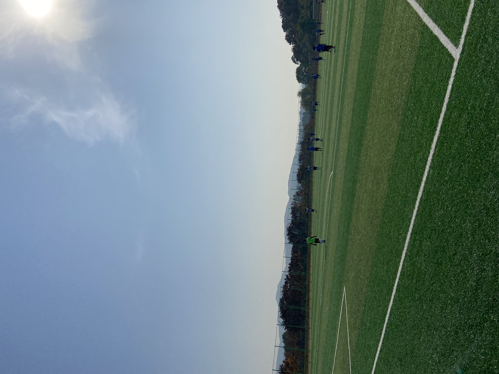

## 💥오늘 한 일💥
축구

## 축구

 📌배뫼산 축구장 

위드 코로나를 시행하고 실외스포츠 집합금지가 완화되면서 학교 축구 동아리를 오랜만에 갔다. 거의 3개월만에 축구인듯.. 9시 30분쯤 출발했는데 강변북로가 주차장이 되었다. 10:30분까지 모이기로 해서 네비로 1시간 걸리길래 9시 30분에 나왔는데 2시간이 걸려서 도착했다. 이게 말이되나..? 총 5경기인가 뛰었는데 첫번쨰는 늦어서 못뛰고 두번째 경기부터 왼쪽 윙 포워드, 센터 포워드로 뛰었다. 내가 뛴 첫경기에서 어시스트를 하나 했다. 센터 서클쯤에서 공을 받고 앞에 포워드에게 찔러줬는데 그대로 마무리가 되었다. 포워드가 진짜 개잘한다... 그런데 첫경기를 뛰고 너무 힘들어서 토할뻔했다. 운동을 평소에도 안했지만 이정도로 체력이 쓰레기였을 줄이야... 두번째 경기 뛰고 세번째 경기에는 골키퍼를 했다. 너무 힘들어서...ㅋㅋㅋ 1실점이였는데 상대팀의 프리킥이 환상적이여서 야신존으로 들어갔다. 손끝에 살짝 스쳤지만 못막았다. 오프더볼, 스피드, 킥력 엄청 잘하는건 아니지만 어느정도 할줄 아는데 체력이 안되니까 공간이 보여도 움직일수가 없었다. 슈팅도 호흡이 부족하니까 땅볼로 가거나 홈런을 쳤다. 1:1 한번 놓쳤다😱 오랜만에 하는 축구라 다음날 근육통이 걱정되지만 재밌게 차고 왔다.  